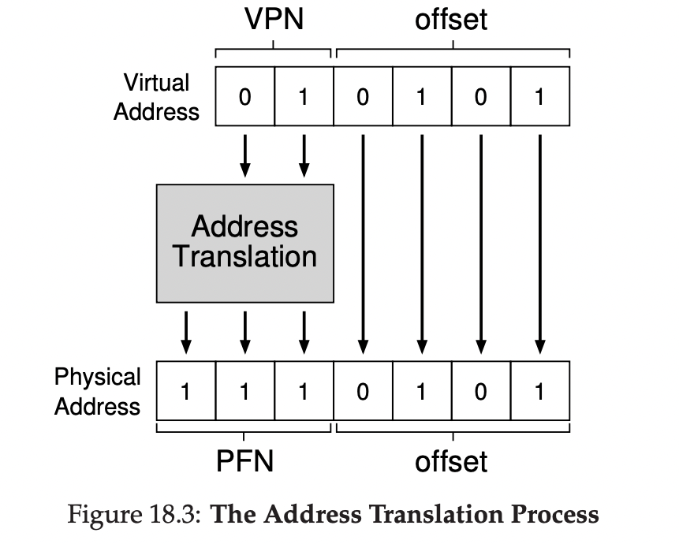
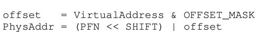

# 페이징: 개요[^ypilseong]
[^ypilseong]: [양필성](https://github.com/ypilseong)

- 세그멘테이션은 공간을 다양한 크기의 청크로 분할할 때 공간 자체가 단편화(fragmented)될 수 있고, 할당은 점점 더 어려워집니다.
- 다른 방법은 공간을 동일 크기의 조각으로 분할하는 페이징(paging)</strong> 기법입니다.
    - 프로세스의 주소 공간을 몇개의 가변 크기의 논리 세그멘트(코드, 힙, 스택)로 나누는 것이 아니라 고정 크기의 단위로 나눕니다. 이 각각의 단위를 페이지(page)라고 부릅니다. 상응하여 물리 메모리도 페이지 프레임(page frame)이라고 불리는 고정 크기의 슬롯의 배열이라고 생각합니다.


## 간단한 예제 및 개요

아래 그림은 총 64byte이면서 4개의 16byte로 구성된 작은 주소 공간의 예를 보여줍니다.


물리 메모리는 아래 그림과 같이 고정 크기의 슬롯들로 구성됩니다.

이 경우 8개의 페이지 프레임, 총 128byte의 비현실적으로 작은 물리 메모리입니다.


가상 주소 공간 AS( Address Space )의 페이지들이 페이지 프레임에 분산 배치되어 있다는 것을 알 수 있습니다.

그림은 또한 운영체제가 자기 자신을 위해 물리 메모리의 일부를 사용하는 것도 보여줍니다.

앞으로 보겠지만 페이징의 가장 큰 장점은 유연성입니다.

페이징을 사용하면 프로세스의 주소 공간 사용방식과는 상관없이 효율적으로 주소 공간 개념을 지원할 수 있습니다.

예를 들어, 힙과 스택이 어느 방향으로 커지는가, 어떻게 사용되는가 같은 생각을하지 않아도 됩니다.

또 다른 장점은 단순함입니다.

운영체제가 64byte의 가상 주소 공간을 8페이지 물리 메모리에 배치하기를 원한다면, 운영체제는 비어있는

4개의 페이지만 찾으면 됩니다. 아마 이를 위해 운영체제는 비어 있는 페이지의 빈 공간 리스트를 유지하고, 리스트의 첫 네개 페이지를 선택할 것입니다.

주소 공간의 각 가상 페이지에 대한 물리 메모리 위치 기록을 위하여 운영체제는 프로세스마다 **페이지 테이블 ( page table )** 이라는 자료구조를 유지합니다.

이 페이지 테이블의 주요 역할은 가상 주소 공간의 가상 페이지 주소 변환 정보를 저장하는 것입니다.

각 페이지가 저장된 물리 페이지 프레임의 위치를 저장하는 것입니다.

위의 예시에서는 ( VP 0 → PF 3 ) , ( VP 1 → PF 7 ) , ( VP 2 → PF 5 ), ( VP 3 → PF 2 ) 입니다.

**페이지 테이블은 프로세스마다 존재한다는 것을 숙지해야합니다.**

위의 예에서 다른 프로세스를 실행한다하면, 이 프로세를 위한 다른 페이지 테이블이 필요로 할 것 입니다.

이제 주소 변환 준비가 되었으니. 예시를 보겠습니다.

작은 주소 공간 ( 64 byte ) 를 가진 프로세스가 메모리 접근을 수행한다고 가정하겠습니다.

    movl <virtual address>, %eax

**virtual address**의 데이터를 eax 레지스터에 탑재하는 것에 집중하겠습니다.

프로세스가 생성한 가상 주소의 변환을 위해 먼저 가상 주소를 가상 페이지 번호와 페이지 내의 오프셋 2개의 구성 요소로 분할합니다.

이 예에서는 64byte이기 때문에, 가상 주소는 6비트가 필요로합니다.


페이지 크기는 64byte 주소 공간에서 16byte입니다.

따라서 4개의 페이지를 선택할 수 있어야하며 상위 2비트(Virtual Page Number)이 그 역할을 하게 됩니다.

나머지 비트는 페이지 내에서 우리가 원하는 바이트의 위치를 나타냅니다. 이것을 offset이라고 부릅니다.

이제 실제 예시를 보겠습니다.

    movl 21, %eax

21을 이진 형식으로 변환하면 010101을 얻게 되므로, VPN은 1, offset은 5임을 알 수 있습니다.

아까 예시에서 VPN1 은 PF 7과 매칭 되었기때문에, 주소변환은 아래와 같은 과정으로 이루어집니다.



offset은 동일하게 적용되며, VPN만 PFN으로 변환되어 최종적으로 1110101이라는 물리주소를 얻게 됩니다.

## 페이지 테이블은 어디에 저장되는가

페이지 테이블은 매우 커질 수 있습니다.

우리가 이전에 논의했던 작은 세그멘트 테이블이나 base-bound 쌍에 비해 말이죠.

예를들어, 4KB 크기의 페이지를 가지는 전형적인 32bit 주소 공간을 생각해보겠습니다.

이 가상 주소는 20bit VPN과 12bit offset으로 이루어져있습니다. ( 2^12 = 4KB , 나머지는 VPN )

20bits의 VPN은 운영체제가 각 프로세스를 위해 관리해야하는 변환의 개수가 2^20이라는 것을 의미합니다.

물리 주소로의 변환 정보와 다른 필요한 정보를 저장하기 위하여 **Page Table Entry( PTE, 페이지 테이블 항목 )** 마다 4byte가 필요하다고 가정하면, 각 페이지 테이블을 저장하기 위하여 4MB(4byte * 2^20)의 메모리가 필요하게 됩니다.

만약 100개의 프로세스가 실행중이면 400MB의 메모리가 필요로 된다는 것을 의미합니다.

GB단위의 메모리를 갖고 있는 현재에도 변환을 위해 위와 같이 많은 메모리가 필요로한다는 것은 조금 비정상적입니다.

프로세스의 페이지 테이블이 메모리에 상주한다고 가정을 했을 때


위 그림을 보면 PF0에 페이지 테이블이 존재하는 것을 볼 수 있습니다.


## 페이지 테이블에는 실제 무엇이 있는가


페이지 테이블은 가상 주소(페이지번호)를 물리 주소(물리 페이지 프레임 번호)로 매핑하는데 사용하는 자료구조입니다.

가장 간단한 형태는 선형 페이지 테이블입니다.

단순한 배열 형채로, 원하는 물리 프레임 번호(PFN)를 찾기위해 가상 페이지 번호(VPN)로 배열의 항목에 접근하고 그 항목의 페이지 테이블 항목(PTE)을 검색합니다.

각 PTE에는 여러 비트들이 존재합니다.

- Valid Bit는 특정 변환의 유효 여부를 나타내기 위해 포함됩니다.

    - 예를 들어, 프로그램이 실행을 시작할 때 코드와 힙이 주소 공간의 한쪽에 있고 반대쪽은 스택이 차지하고 있을 겁니다. 그 사이의 모든 미사용 공간은 invalid로 표시되며 프로세스가 그런 메모리를 접근하려고하면 trap을 발생시킵니다.

- Protection Bit는 페이지가 읽을 수 있는 지, 쓸 수 있는 지, 또는 실행될 수 있는지를 표시하기 위해 포함됩니다. 허용되지 않은 방식으로 접근시에 trap을 발생시킵니다.

- Present Bit는 이 페이지가 물리 메모리에 있는지 혹은 디스크로 스왑 아웃 되었는지 나타낼 때 사용됩니다.

- Reference Bit는 때때로 페이지가 접근되었는지 추적할 때 사용됩니다. 또한 어떤 페이지가 인기 있는지 결정하여 메모리에 유지되어야하는 페이지를 결정하는데 유용합니다.

## 페이징: 너무 느림


페이지 테이블의 크기가 메모리 상에서 매우 크게 증가할 수 있는 가능성이 있습니다.

이로 인해 처리 속도가 저하될 가능성도 존재합니다.

간단한 명령어를 예로 보겠습니다.

    movl 21, %eax

21에 대한 참조만 고려하고 명령어 반입에 대해서는 고려하지 않기로 가정하겠습니다.

데이터를 가져오기위해 21을 정확한 물리 주소인 117로 먼저 변환을 합니다.

주소 117에서 데이터를 반입하기 전에 시스템은 프로세스의 페이지 테이블에서 적절한 페이지 테이블 항목을 가져와야 하고, 변환을 수행한 후, 물리 메모리에서 데이터를 탑재합니다.

이렇게 하기 위해서는 하드웨어는 현재 실행 중인 프로세스의 페이지 테이블의 위치를 알아야합니다.

일단 당분간은 하나의 페이지 테이블 베이스 레지스터(Page Table Base Register)가 페이지 테이블의 시작 주소를 저장한다고 가정하겠습니다.


이 예제에서는 전체 가상 주소에서 VPN을 가져오고 PageTableBaseRegister에 PTE의 size*VPN을 더하여 PTE의 주소를 찾습니다.

이 주소를 찾았으니 PTE를 반입할 수 있고, PFN을 추출하고 가상 주소의 오프셋과 연결하여 원하는 물리 주소를 만듭니다.



이제 이러한 방법으로 메모리에 원하는 데이터를 가져와서 eax 레지스터에 넣을 수 있음을 알게 되었습니다.

위와 같은 작업을 하는 것을 보고 우리는 여러 문제를 알게 되었습니다.

모든 메모리 참조마다 페이지 테이블에서 변환 정보를 반입해야하기 때문에 반드시 한번의 추가적인 메모리 참조가 발생합니다. 메모리 참조의 비용은 비싸기 때문에 프로세스는 2배이상 느려질 수 있습니다.


## 메모리 트레이스

간단한 메모리 액세스 예시를 통해 페이징을 사용했을 대 발생하는 모든 메모리 접근을 보겠습니다.


위 코드는 페이징을 사용한 메모리 접근 코드입니다.
```
int array[1000];

for(i=0;i<1000;i++){
	arr[i] = 0;
}
```

메모리 액세스 예시를 보기위해 위 코드를 디스어셈블하여 어떤 메모리 접근이 존재하는지 보겠습니다.

```
1024 movl $0x0,(%edi,%eax,4) // edi + 4 * eax 에 0을 대입. 
1028 incl %eax               // edi : 배열 시작 주소, eax : 인덱스
1032 cmpl $0x03e8,%eax       // 1000보다 작은지 비교
1036 jne 0x1024              // 두 값이 같지 않다면 다시 1024로 분기
``` 

이 예에서는 크기가 64KB인 가상 주소 공간을 가정하겠습니다.

페이지 크기는 1KB로 가정하겟습니다.

우리가 알아야 할 것은 페이지 테이블의 내용과 위치입니다.

선형 페이지 테이블이며, 물리 주소 1KB에 위치한다고 가정하겠습니다.

위 예에서 신경 써야 할 몇 개의 페이지 테이블의 페이지가 있습니다.

1. 코드가 상주하는 가상 페이지 ( 페이지 크기가 1KB이기 때문에, 가상 주소 1024는 가상 주소 공간의 VPN1에 존재한다고 가정하겠습니다. )

2. 배열 자체. 크기는 4000 byte이고, 가상 주소 40000에서 44000 까지 ( 마지막 byte 미포함 ) 존재한다고 가정하겠습니다.
이 범위에서 필요한 가상 페이지는 VPN=39.. VPN = 42 입니다.
각 가상 페이지는 다음과 같은 물리 페이지 프레임과 매칭 된다고 가정하겠습니다.
( VPN 39 → PFN 7 , VPN 40 → PFN 8 , VPN 41 → PFN 9 ,VPN 42 → PFN 10 )

이제 프로그램의 메모리 참조를 살펴보겠습니다.

프로그램이 실행되면, 명령어 반입 시에 메모리가 두 번 참조 됩니다.

명령어 위치 파악을 위한 페이지 테이블 접근 한 번 그리고 명령어 자체에 한번 이렇게 두번입니다.

mov 명령어는 메모리 참조를 한번합니다. 이 명령어도 먼저 페이지 테이블 접근 한번, 다음 배열 자체를 접근하기 위하여 한번의 참조가 필요합니다.


위 그림은 i = 0 ~ i = 4까지의 메모리 참조를 나타낸 표입니다.

일단, 한 번의 반복시 명령어를 접근하기 위해 4번의 메모리 접근이 발생합니다.

그 후, 1번의 Array 메모리 접근을 통한 업데이트와 5번의 페이지 테이블 접근이 발생합니다.

⇒ 결국 한 번의 반복을 할 때마다 10번의 메모리 접근이 발생 합니다.


## 요약

페이징은 세그멘테이션과 같은 방식에비해 많은 장점을 갖고 있습니다.

페이징은 하드웨어적으로 메모리를 특정 단위로 분할하고, 빈 부분이 많은 경우에도 효율적으로 지원할 수 있습니다.

하지만, 현재까지 알아본바로는 아직 성능저하와 페이지 테이블을 위한 메모리 공간 할당으로 인한 메모리 낭비의 가능성이 존재합니다.