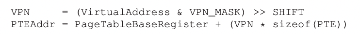
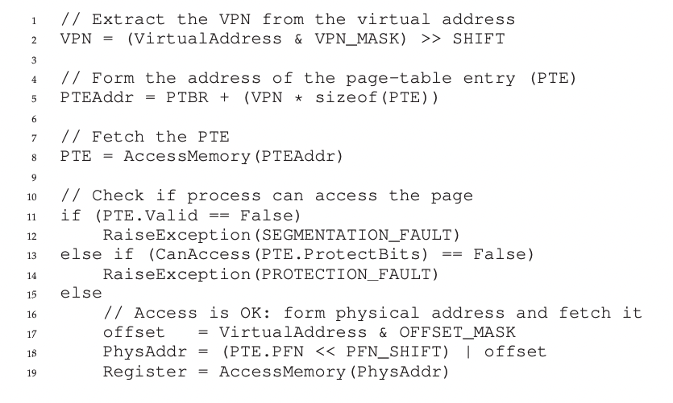

# 페이징: 개요[^ypilseong]

[^ypilseong]: [양필성](https://github.com/ypilseong)

운영체제는 공간 관리 문제를 해결할 때 주로 두 가지 방법 중 하나를 사용합니다. 첫 번째 방법은 가상 메모리의 세그멘테이션에서 보았듯이, 공간을 가변 크기의 조각으로 분할하는 것입니다. 그러나 이 방법은 공간 자체가 단편화될 수 있고, 할당이 점점 더 어려워진다는 태생적인 문제를 가지고 있습니다.

두 번째 방법은 공간을 동일 크기의 조각으로 분할하는 것입니다. 가상 메모리에서 이를 페이징(Paging)이라고 부르며, 이 아이디어의 기원은 초기의 중요한 시스템인 Atlas까지 거슬러 올라갑니다. 페이징에서는 프로세스의 주소 공간을 가변 크기의 논리 세그멘트로 나누는 대신, 고정 크기의 단위인 페이지(Page)로 나눕니다. 이에 상응하여 물리 메모리도 페이지 프레임(Page Frame)이라고 불리는 고정 크기의 슬롯 배열로 간주합니다. 각 페이지 프레임은 하나의 가상 메모리 페이지를 저장할 수 있습니다.

> 핵심 질문: 페이징을 사용하여 어떻게 메모리를 가상화할 수 있을까요? 세그멘테이션의 문제점을 해결하기 위해 페이징을 어떻게 활용할 수 있을까요? 기본 기법은 무엇이며, 공간과 시간 오버헤드를 최소화하면서 그 기법을 잘 동작하게 만들기 위한 방법은 무엇일까요?

## 간단한 예제 및 개요

아래 그림은 총 64바이트이며 4개의 16바이트 페이지로 구성된 작은 주소 공간의 예를 보여줍니다.


물리 메모리는 고정 크기의 슬롯들로 구성되며, 이 예에서는 8개의 페이지 프레임으로 이루어진 총 128바이트의 비현실적으로 작은 물리 메모리를 가정합니다.


가상 주소 공간(Address Space, AS)의 페이지들이 페이지 프레임에 분산 배치되어 있음을 알 수 있습니다. 또한 운영체제가 자기 자신을 위해 물리 메모리의 일부를 사용하는 것도 볼 수 있습니다.

페이징의 가장 큰 장점은 유연성입니다. 페이징을 사용하면 프로세스의 주소 공간 사용 방식과 상관없이 효율적으로 주소 공간 개념을 지원할 수 있습니다. 예를 들어, 힙과 스택이 어느 방향으로 커지는지, 어떻게 사용되는지에 대해 고민할 필요가 없습니다.

또 다른 장점은 단순함입니다. 운영체제가 64바이트의 가상 주소 공간을 8페이지 물리 메모리에 배치하려면, 단순히 비어 있는 4개의 페이지만 찾으면 됩니다. 이를 위해 운영체제는 빈 페이지 리스트를 유지하고, 리스트의 첫 네 개 페이지를 선택할 수 있습니다.

운영체제는 주소 공간의 각 가상 페이지에 대한 물리 메모리 위치를 기록하기 위해 프로세스마다 페이지 테이블(Page Table)이라는 자료구조를 유지합니다. 페이지 테이블의 주요 역할은 가상 주소 공간의 각 페이지에 대한 주소 변환 정보, 즉 각 페이지가 저장된 물리 페이지 프레임의 위치를 저장하는 것입니다.

위의 예시에서는 가상 페이지(VP) 0은 물리 페이지 프레임(PF) 3에, VP 1은 PF 7에, VP 2는 PF 5에, VP 3은 PF 2에 매핑되어 있습니다. 페이지 테이블은 프로세스마다 존재한다는 점을 기억해야 합니다. 다른 프로세스를 실행한다면, 그 프로세스를 위한 별도의 페이지 테이블이 필요할 것입니다.

이제 주소 변환 과정을 살펴보겠습니다. 64바이트의 작은 주소 공간을 가진 프로세스가 메모리 접근을 수행한다고 가정해 보겠습니다.

```
movl <virtual address>, %eax
```

이 명령어는 가상 주소의 데이터를 eax 레지스터에 로드합니다. 프로세스가 생성한 가상 주소를 변환하기 위해, 먼저 가상 주소를 가상 페이지 번호(VPN)와 페이지 내의 오프셋(Offset)이라는 두 개의 구성 요소로 분할합니다.

이 예에서는 64바이트 주소 공간이므로, 가상 주소는 6비트가 필요합니다. 페이지 크기는 16바이트이므로, 4개의 페이지를 선택할 수 있어야 합니다. 상위 2비트(VPN)가 페이지를 선택하는 역할을 하고, 나머지 비트(Offset)는 페이지 내에서 원하는 바이트의 위치를 나타냅니다.

실제 예시를 보겠습니다.

```
movl 21, %eax
```

21을 이진수로 변환하면 010101이므로, VPN은 1, Offset은 5입니다. 앞서 예시에서 VPN 1은 PF 7과 매핑되었으므로, 주소 변환 과정은 다음과 같습니다.


Offset은 동일하게 적용되고, VPN만 PFN으로 변환되어 최종적으로 1110101이라는 물리 주소를 얻게 됩니다.

## 페이지 테이블은 어디에 저장되는가?

페이지 테이블은 매우 커질 수 있습니다. 예를 들어, 4KB 크기의 페이지를 가지는 전형적인 32비트 주소 공간을 생각해 보겠습니다. 이 가상 주소는 20비트 VPN과 12비트 Offset으로 구성됩니다(2^12 = 4KB, 나머지는 VPN).

20비트의 VPN은 운영체제가 각 프로세스를 위해 관리해야 하는 변환의 개수가 2^20개라는 것을 의미합니다. 물리 주소로의 변환 정보와 기타 필요한 정보를 저장하기 위해 페이지 테이블 항목(Page Table Entry, PTE)마다 4바이트가 필요하다고 가정하면, 각 페이지 테이블을 저장하기 위해 4MB(4바이트 \* 2^20)의 메모리가 필요합니다.

만약 100개의 프로세스가 실행 중이라면 400MB의 메모리가 필요하다는 것을 의미합니다. 현재와 같이 GB 단위의 메모리를 갖고 있는 상황에서도 주소 변환을 위해 이렇게 많은 메모리가 필요하다는 것은 다소 비정상적입니다.

프로세스의 페이지 테이블이 메모리에 상주한다고 가정할 때의 모습은 다음과 같습니다.


위 그림에서 PF0에 페이지 테이블이 존재하는 것을 볼 수 있습니다.

## 페이지 테이블에는 실제로 무엇이 있는가?

페이지 테이블은 가상 주소(페이지 번호)를 물리 주소(물리 페이지 프레임 번호)로 매핑하는 데 사용하는 자료구조입니다. 가장 간단한 형태는 선형 페이지 테이블로, 단순한 배열 형태입니다. 원하는 물리 프레임 번호(PFN)를 찾기 위해 가상 페이지 번호(VPN)로 배열의 항목에 접근하고, 그 항목의 페이지 테이블 항목(PTE)을 검색합니다.

각 PTE에는 다음과 같은 여러 비트들이 포함됩니다:

- Valid Bit: 특정 변환의 유효 여부를 나타내기 위해 사용됩니다. 예를 들어, 프로그램이 실행을 시작할 때 코드와 힙이 주소 공간의 한쪽에 있고 반대쪽은 스택이 차지하고 있을 것입니다. 그 사이의 모든 미사용 공간은 invalid로 표시되며, 프로세스가 그런 메모리에 접근하려고 하면 트랩(Trap)이 발생합니다.

- Protection Bit: 페이지가 읽기 가능한지, 쓰기 가능한지, 실행 가능한지를 표시하기 위해 사용됩니다. 허용되지 않은 방식으로 접근할 경우 트랩이 발생합니다.

- Present Bit: 해당 페이지가 물리 메모리에 존재하는지, 아니면 디스크로 스왑 아웃되었는지를 나타내는 데 사용됩니다.

- Reference Bit: 페이지가 접근되었는지를 추적하는 데 사용됩니다. 이는 어떤 페이지가 인기 있는지 결정하여 메모리에 유지되어야 할 페이지를 판단하는 데 유용합니다.

## 페이징: 너무 느림

페이징을 사용할 때 페이지 테이블의 크기가 메모리 상에서 매우 크게 증가할 가능성이 있습니다. 이로 인해 처리 속도가 저하될 수 있는데, 이를 간단한 명령어 예시를 통해 살펴보겠습니다.

```
movl 21, %eax
```

이 명령어는 21번 메모리 주소에서 데이터를 가져와 eax 레지스터에 저장합니다. 여기서는 명령어 자체의 반입은 고려하지 않고, 데이터 21에 대한 참조만 살펴보겠습니다.

데이터를 가져오기 위해서는 먼저 가상 주소 21을 물리 주소 117로 변환해야 합니다. 주소 117에서 데이터를 가져오기 전에 시스템은 다음과 같은 단계를 거쳐야 합니다:

1. 프로세스의 페이지 테이블에서 해당 가상 주소에 대한 페이지 테이블 항목(Page Table Entry, PTE)을 읽어옵니다.
2. PTE를 사용하여 가상 주소를 물리 주소로 변환합니다.
3. 변환된 물리 주소를 통해 실제 데이터를 메모리에서 읽어옵니다.

이를 위해 하드웨어는 현재 실행 중인 프로세스의 페이지 테이블 위치를 알고 있어야 합니다. 일단 페이지 테이블의 시작 주소가 페이지 테이블 기준 레지스터(Page Table Base Register, PTBR)에 저장되어 있다고 가정하겠습니다.



이 예제에서는 전체 가상 주소에서 가상 페이지 번호(Virtual Page Number, VPN)를 추출하고, 페이지 테이블 기준 레지스터의 값에 PTE 크기와 VPN을 곱한 값을 더하여 해당 PTE의 주소를 계산합니다.

PTE의 주소를 알아냈으니 이제 PTE를 메모리에서 읽어올 수 있습니다. PTE에서 물리 페이지 프레임 번호(Physical Page Frame Number, PFN)를 추출하고, 이를 가상 주소의 오프셋과 결합하여 최종 물리 주소를 생성합니다.


이러한 과정을 거쳐 우리는 메모리에서 원하는 데이터를 읽어와 eax 레지스터에 저장할 수 있게 되었습니다.

하지만 이 과정에서 몇 가지 문제점을 발견할 수 있습니다. 가장 큰 문제는 모든 메모리 참조마다 페이지 테이블에서 주소 변환 정보를 읽어와야 한다는 점입니다. 이로 인해 메모리 접근이 최소 한 번 더 발생하게 되는데, 메모리 접근은 비용이 높은 연산이므로 프로그램의 실행 속도가 크게 저하될 수 있습니다.

## 메모리 트레이스

페이징을 사용할 때 발생하는 메모리 접근을 더 자세히 알아보기 위해 간단한 메모리 접근 예시를 살펴보겠습니다.



위 코드는 페이징이 적용된 환경에서 배열의 모든 요소를 0으로 초기화하는 간단한 C 프로그램입니다.

```c
int array[1000];

for (i = 0; i < 1000; i++) {
    array[i] = 0;
}
```

이 코드가 실제로 어떤 메모리 접근을 수행하는지 알아보기 위해 어셈블리어로 디스어셈블해 보겠습니다.

```
1024 movl $0x0,(%edi,%eax,4)  ; edi + 4 * eax 주소에 0을 저장
1028 incl %eax               ; eax 레지스터 값을 1 증가 (eax는 배열 인덱스)
1032 cmpl $0x03e8,%eax       ; eax와 1000을 비교
1036 jne 0x1024              ; eax != 1000이면 1024로 점프
```

이 예시에서는 64KB 크기의 가상 주소 공간과 1KB 크기의 페이지를 가정하겠습니다. 우리가 알아야 할 중요한 정보는 페이지 테이블의 내용과 위치입니다. 여기서는 페이지 테이블이 선형 구조이고 물리 주소 1KB에 위치한다고 가정하겠습니다.

이 예시에서 주목해야 할 페이지는 다음과 같습니다:

1. 코드가 위치한 가상 페이지 (페이지 크기가 1KB이므로 가상 주소 1024는 VPN 1에 해당)
2. 배열이 차지하는 가상 페이지 (배열 크기는 4000바이트이고 가상 주소 40000부터 43999까지 위치한다고 가정, 따라서 VPN 39부터 VPN 42까지 사용)

각 가상 페이지는 다음과 같이 물리 페이지 프레임에 매핑되어 있다고 가정하겠습니다:

- VPN 39 → PFN 7
- VPN 40 → PFN 8
- VPN 41 → PFN 9
- VPN 42 → PFN 10

이제 프로그램의 메모리 참조를 단계별로 살펴보겠습니다. 프로그램이 실행되면 명령어를 메모리에서 읽어와야 하므로 페이지 테이블 접근이 한 번, 실제 명령어 접근이 한 번, 총 두 번의 메모리 접근이 발생합니다.

`movl` 명령어는 메모리 참조를 한 번 수행합니다. 이 명령어를 수행하기 위해서도 페이지 테이블 접근이 한 번, 실제 데이터(배열 요소) 접근이 한 번, 총 두 번의 메모리 접근이 필요합니다.


위 그림은 루프 변수 i가 0부터 4까지 증가할 때 발생하는 메모리 참조를 나타낸 것입니다. 각 루프 반복마다 명령어를 읽어오기 위해 4번의 메모리 접근(페이지 테이블 접근 3회 + 실제 명령어 접근 1회)이 발생하고, 배열 요소를 업데이트하기 위해 2번의 메모리 접근(페이지 테이블 접근 1회 + 실제 데이터 접근 1회)이 발생합니다.

즉, 루프를 한 번 반복할 때마다 총 10번의 메모리 접근이 발생하게 됩니다. 이는 페이징 기법을 사용할 때 발생하는 성능 저하를 잘 보여주는 예시입니다.

## 요약

페이징은 메모리를 고정된 크기의 페이지 단위로 나누어 관리하는 기법으로, 가상 메모리를 물리 메모리에 매핑할 때 유연성과 단순성이라는 장점을 제공합니다. 하지만 페이지 테이블의 크기가 커질 수 있고, 모든 메모리 참조마다 페이지 테이블을 통한 주소 변환이 필요하기 때문에 상당한 성능 저하를 야기할 수 있습니다.

지금까지 살펴본 내용을 바탕으로, 페이징은 메모리 관리를 단순화한다는 장점에도 불구하고 성능 면에서는 큰 문제점을 가지고 있음을 알 수 있습니다. 또한 페이지 테이블 자체를 위한 메모리 공간도 상당히 필요하므로 메모리 사용 효율 측면에서도 비효율적일 수 있습니다.

이러한 문제점들을 해결하기 위해서는 페이징 기법을 더욱 효율적으로 만드는 방안을 모색해야 할 것입니다. 다음 장에서는 이러한 문제를 완화할 수 있는 방법들에 대해 알아보도록 하겠습니다.

## 주요 용어 정리

- 페이징(Paging): 가상 메모리를 고정 크기의 페이지 단위로 관리하는 기법입니다.
- 페이지(Page): 가상 메모리를 고정 크기로 나눈 블록입니다. 주소 변환의 기본 단위가 됩니다.
- 페이지 프레임(Page Frame): 물리 메모리를 페이지 크기의 블록으로 나눈 것입니다. 가상 페이지가 매핑되는 대상입니다.
- 페이지 테이블(Page Table): 가상 페이지 번호를 물리 페이지 프레임 번호로 변환하는 데 사용되는 자료구조입니다.
- 페이지 테이블 항목(Page Table Entry, PTE): 페이지 테이블의 각 항목으로, 가상 페이지와 물리 페이지 프레임 간의 매핑 정보와 추가 메타데이터를 포함합니다.
- 가상 페이지 번호(Virtual Page Number, VPN): 가상 주소의 상위 비트로, 가상 페이지를 식별합니다.
- 오프셋(Offset): 가상 주소의 하위 비트로, 페이지 내의 특정 위치를 나타냅니다.
- 물리 페이지 프레임 번호(Physical Page Frame Number, PFN): 물리 메모리의 특정 페이지 프레임을 식별하는 번호입니다.
