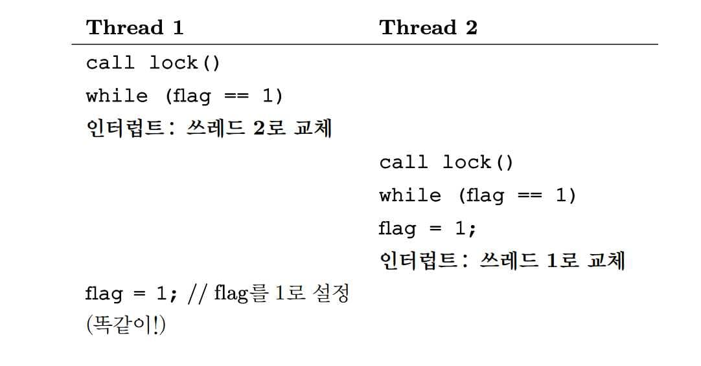

# 락 [^ypilseong]

[^ypilseong]: [양필성](https://github.com/ypilseong)

Lock은 코드의 특정 영역을 감싸서 한 순간에 오로지 한 스레드만 이 영역에 접근할 수 있도록 해주는 것, 즉 Mutual Exclusion을 위해 존재합니다.
이 Lock이 없으면 Multi thread program이 제대로 예상한대로 작동하지 않을 가능성이 높습니다.

## 락: 기본 개념

```sh
balance = balance + 1;
```

다음과 같은 임계 영역이 있다고 하면 락으로 임계 영역을 다음과 같이 감쌌습니다.

```sh
lock_t mutex; // 전역 변수로 선언된 락
...
lock(&mutex);
balance = balance + 1;
unlock(&mutex);
```

락은 하나의 변수이므로, 락을 사용하기 위해 먼저 선언해야 합니다. 이 락 변수는 사용 가능 상태, 즉 어느 쓰레드도 락을 가지고 있지 않거나, 사용 중, 즉 임계 영역에서 정확히 하나의 쓰레드가 락을 획득한 상태입니다.

`lock()`과 `unlock()`의 의미는 간단합니다. `lock()`을 호출하여 락 획득을 시도한다. 만약 어떤 쓰레드도 락을 가지고 있지 않다면 그 쓰레드는 락을 획득하여 임계 영역으로 진입합니다. 이렇게 진입한 쓰레드를 _락 소유자 (owner)_ 라고 부른다. 만약 다른 쓰레드가 `lock()`을 호출한다면, 사용 중인 동안에는 `lock()` 함수가 리턴하지 않습니다.

락 소유자가 `unlock()`을 호출한다면 락은 이제 다시 사용 가능한 상태가 됩니다. 어떤 쓰레드도 이 락을 대기하고 있지 않다면 (어떤 쓰레드도 `lock()`을 호출하여 멈춰 있던 상태가 아니라면) 락의 상태는 사용 가능으로 유지됩니다.

락은 프로그래머에게 스케줄링에 대한 최소한의 제어권을 제공합니다. 쓰레드에 대한 제어권을 일부 받을 수 있습니다. 이를 통해 프로그래머는 그 코드 내에서 하나의 쓰레드만 동작하도록 보장합니다. 혼란스런 실행 순서에 어느 정도 질서를 부여할 수 있는 것입니다.

## Pthread 락

쓰레드 간 _상호 배제 (mutual exclusion)_ 기능을 제공하기 때문에 POSIX 라이브러리는 락을 _mutex_ 라고 부릅니다. 상호 배제는 한 쓰레드가 임계 영역 내에 있다면, 이 쓰레드의 동작이 끝날 때까지 다른 쓰레드가 임계 영역에 들어올 수 없도록 제한한다고 해서 붙여진 이름입니다.

래퍼를 사용하여 락과 언락시에 에러를 확인하도록 합니다.

```sh
pthread_mutex_t lock = PTHREAD_MUTEX_INITIALIZER;

Pthread_mutex_lock(&lock); // pthread_mutex_lock()을 위한 래퍼.
balance = balance + 1;
Pthread_mutex_unlock(&lock);
```

POSIX 방식은 변수명을 지정하여 락과 언락 함수에 전달합니다. 다른 변수를 보호하기 위해 다른 락을 사용할수도 있기 때문입니다. 이를 통해 여러가지 방식으로 락을 구현할 수 있습니다.

### 세밀한 락과 거친 락 전략

- 거친 락 (Coarse-Grained Locking)
  1. 하나의 락이 큰 임계 영역을 제어함.
  2. 쉽게 구현할 수 있지만, 병렬성이 제한됨.
- 세밀한 락 (Fine-Grained Locking)
  1. 여러 락이 서로 다른 데이터나 자료구조를 보호함.
  2. 한 번에 여러 쓰레드가 서로 다른 락으로 보호된 코드 내에 진입 가능.
  3. 병렬성은 향상되지만, 데드락 등의 복잡한 이슈에 대처해야 함.

## 락 구현

## 락의 평가

- 상호 배제 (mutual exclusion)
  1. 가장 기본 역할.
  2. 임계 영역 내로 다수의 쓰레드가 진입하는 것을 막을 수 있는지 검사해야 함.
- 공정성 (fairness)
  1. 여러 쓰레드들이 락을 번갈아가면서 획득할 수 있어야 함.
  2. 락을 전혀 얻지 못해 굶주리는 경우가 발생하면 안 됨.
- 성능 (performance)
  1. 락 사용에 대한 시간적 오버헤드를 평가해야 한다.
  2. 하나의 쓰레드가 실행 중에 락을 획득하고 해제하는 과정에서 발생하는 부하가 얼마나 되는가?

## 인터럽트 제어

초창기 단일 프로세서 시스템에서는 상호 배제 지원을 위해 임계 영역 내에서 인터럽트를 비활성화 하는 방법을 사용했습니다.

```sh
void lock() {
	DisableInterrupts();
}
void unlock() {
	EnableInterrupts();
}
```

이 방법의 장점은 단순하다는 것이고, 단점은 많습니다.

1. 먼저, 이 요청을 하는 쓰레드가 인터럽트를 활성화/비활성화 하는 커널 모드 특권 연산을 실행할 수 있도록 허가해야 합니다. 만약 어떤 프로그램이 시작과 동시에`lock()`을 호출하고 무한 반복문에 들어간다면, 운영체제는 시스템의 제어권을 다시 얻을 수 없습니다.
2. 또, 멀티프로세서에서는 적용을 할 수 없습니다. 여러 쓰레드가 여러 CPU에서 실행 중이라면, 각 쓰레드가 동일한 임계 영역에 진입하려고 할 수 있습니다. 이 떄 인터럽트를 비활성화하는 것은 다른 프로세서에서 실행중인 프로그램에는 전혀 영향을 주지 않습니다. 즉, 임계 영역에 진입하는 것을 막을 수 없습니다.
3. 장시간 인터럽트를 중지시키는 것은 중요한 인터럽트 시점을 놓치게 할 수 있습니다. CPU가 저장 장치에서 읽기 요청을 마친 사실을 모르고 지나갔다고 해보자. 운영체제는 읽기 결과를 기다리는 프로세스를 깨울 수 없을 것입니다.
4. 마지막으로, 비효율적입니다. 일반적인 명령어에 비해 인터럽트를 비활성화시키는 코드들은 최신 CPU에서는 느리게 실행됩니다.

따라서, 인터럽트 비활성화는 제한된 범위에서만 사용되어야 합니다. 예를 들어, 운영체제가 내부 자료 구조에 atomic 연산을 하기 위해 등

## Test-And-Set (Atomic Exchange)

멀티 프로세서 시스템에서는 인터럽트를 중지시키는 것이 의미가 없기 때문에 시스템 설계자들은 락 지원을 위한 하드웨어를 설계하기 시작했습니다. 오늘날에는 모든 시스템이 이러한 지원 기능을 가지고 있습니다.

하드웨어 기법 중 가장 기본은 _Test-And-Set_ 명령어 또는 _원자적 교체 (atomic exchange)_ 라고 불리는 기법입니다. 이를 이해하기 위해 간단한 플래그 변수로 락을 구현.

```sh
typedef struct __lock_t { int flag; } lock_t;

void init(lock_t *mutex) {
	// 0: 락 사용 가능
	// 1: 락 사용 중
	mutex−>flag = 0;
}

void lock(lock_t *mutex) {
	while (mutex−>flag == 1) // flag 변수를 검사 (test) 한다
	; // spin−wait (do nothing)
	mutex−>flag = 1; // 이제 설정 (set) 한다
}

void unlock(lock_t *mutex) {
	mutex−>flag = 0;
}
```

간단한 변수를 사용해 쓰레드가 락을 획득했는지 나타냅니다. 임계 영역에 진입하는 첫 쓰레드가 `lock()`을 호출하여 플래그가 1인지 검사(test) 하고 플래그의 값을 1로 설정(set) 하여 이 쓰레드가 락을 보유(hold) 하고 있다고 표시합니다. 임계 영역에서 나오면 쓰레드가 `unlock()`을 호출하여 플래그 값을 초기화하고, 락을 더 이상 보유하고 있지 않다고 표시합니다.

만약 첫 번째 쓰레드가 임계 영역 내에 있을 때 다른 쓰레드가 `lock()`을 호출하면 그 쓰레드는 `while`문으로 *spin-wait*을 하며 처음 쓰레드가 `unlock()`을 호출하여 플래그를 초기화하기를 기다힙니다. 처음 쓰레드가 플래그를 초기화하면 대기하던 쓰레드는 `while` 문에서 빠져나와 플래그를 1로 설정하고 임계 영역 내로 진입합니다.

이 코드에는 두 가지 문제가 있습니다.

### 정확성



시작할 때 `flag = 0`이라 합시다. 쓰레드 1이 `flag = 1`을 실행하기 직전에 인터럽트가 일어난다면? 두 쓰레드 모두 플래그를 1로 설정하도록 하는 인터럽트 타이밍이 존재합니다. 두 쓰레드 모두 임계 영역에 진입하게 됩니다. 잘못 만들었습니다.

### 성능

spin wait을 통해 플래그의 값을 무한히 검사하는데, 이는 성능상 좋지 못합니다. 특히 단일 프로세서에서. 락을 소유한 쓰레드조차 실행하기 힘들도록 합니다.

## 진짜 돌아가는 스핀 락의 구현

앞서 다룬 예제는 하드웨어 지원 없이는 동작이 불가능했습니다. 다행히도 어떤 시스템은 이 개념에 근간한 락 구현을 위한 어셈블리 명령어를 제공합니다. SPARC에서는 `ldstub`, x86에서는 원자적 교체 명령어인 `xchg`이다. 기본적으로 동일한 일을 수행합니다. 일반적으로 Test-And-Set 이라고 불립니다. `TestAndSet` 동작을 정의해보자.

```sh
int TestAndSet(int *old_ptr, int new) {
	int old = *old_ptr; // old_ptr의 이전 값을 가져옴
	*old_ptr = new; // old_ptr 에 new 값을 저장함
	return old; // old의 값을 반환함
}
```

`TestAndSet` 명령어가 하는 동작은 다음과 같다. `ptr`이 가리키고 있던 예전의 값을 반환하고, 동시에 `new` 값을 `ptr`에 저장합니다. 여기서의 핵심은 이 동작들이 원자적으로 수행된다는 것입니다. 이전 값을 검사 (test -> 반환되는 값) 하는 동시에 메모리에 새로운 값을 설정 (set) 합니다.

이 명령어만으로 간단한 spin lock을 만들 수 있습니다.

```sh
typedef struct __lock_t {
	int flag;
} lock_t;

void init(lock_t *lock) {
	// 0은 락이 획득 가능한 상태
	// 1은 락을 획득했음
	lock−>flag = 0;
}

void lock(lock_t *lock) {
	while (TestAndSet(&lock−>flag, 1) == 1)
	; // spin
}

void unlock(lock_t *lock) {
	lock−>flag = 0;
}
```

처음 쓰레드가 `lock()`을 호출하고, 다른 어떤 쓰레드도 현재 락을 보유하고 있지 않다고 하자. 그럼 현재 `flag`의 값은 0입니다. `TestAndSet(flag, 1)`을 호출하면 반환 값은 0 이라 `while`문을 탈출할 수 있습니다. 그리고 `flag`는 1이 됩니다. 이후 이 쓰레드가 동작을 끝마치면 `unlock()`을 호출하여 `flag` 값을 다시 0으로 변경합니다.

처음 쓰레드가 락을 획득하여 `flag`가 1인 상태에서, 두 번째 쓰레드가 `lock()`을 호출한다고 해보자. `TestAndSet(flag, 1)`을 호출하면 반환 값이 1 이라 `while`문을 탈출할 수 없습니다. 락을 보유하고 있는 쓰레드가 존재하는 한 `TestAndSet(flag, 1)`은 계속 1을 반환합니다.

락을 보유하고 있는 처음 쓰레드가 `flag` 값을 0으로 변경하면, 두 번째 쓰레드가 `TestAndSet(flag, 1)`을 호출했을 때 반환 값이 0이 되어 `while`문을 탈출할 수 있게 됩니다.

드디어 제대로 동작하는 상호 배제 함수를 만드는 방법을 배웠습니다. 이것이 가장 기초적인 형태의 락으로써, 락을 획득할 때까지 CPU 사이클을 소모하면서 회전합니다. 단일 프로세서에서 이 방식을 제대로 사용하려면 선점형 스케줄러를 사용해야 합니다. 다른 쓰레드가 실행될 수 있도록 타이머를 통해 인터럽트를 발생시킬 수 있기 때문입니다. 선점형이 아니면 `while`문을 돌리며 대기하는 쓰레드가 CPU를 영원히 독점하게 될 것입니다.

## 스핀 락 평가

락에서 가장 중요한 측면은 상호 배제의 정확성 입니다. 상호 배제가 가능하다면 스핀 락은 임의의 시간에 단 하나의 쓰레드만이 임계 영역에 진입할 수 있도록 합니다.

그 다음의 항목은 공정성입니다. 대기 중인 쓰레드들에 있어서 스핀 락은 얼마나 공정할까? 스핀 락은 어떠한 공정성도 보장해줄 수 없습니다. `while`문을 돌리는 쓰레드가 경쟁에 밀려서 굶주릴 가능성이 존재합니다.

마지막 항목은 성능입니다. 스핀 락을 사용할 때 얼마나 비용을 지불해야 할까? 단일 CPU의 경우 스핀 락이 갖는 성능 오버헤드는 상당히 클 수 있습니다.
𝑁개 중 𝑁 − 1개의 다른 쓰레드가 락을 획득하려고 할 때, 스케줄러가 이들을 한 번씩 깨울 수도 있습니다. CPU가 여러 개인 경우 (쓰레드의 개수와 CPU의 개수가 비슷하다면) 스핀 락은 꽤 합리적으로 동작합니다. CPU 1에서 실행중인 A가 락을 획득한 후 B가 락을 획득하려고 한다면 CPU 2에서 기다리기 때문에 금방 락을 획득할 수 있을 것입니다.

## Compare-And-Swap

또 다른 하드웨어 기법은 SPARC의 _Compare-And-Swap_, x86의 *Compare-And-Exchange*가 있습니다.

```sh
int CompareAndSwap(int *ptr, int expected, int new) {
	int actual = *ptr;
	if (actual == expected)
		*ptr = new;
	return actual;
}
```

Compare-And-Swap 기법의 기본 개념은 `ptr`이 가리키고 있는 주소의 값이 `expected` 변수와 일치하는지 검사하는 것입니다. 만약 일치한다면 `ptr`이 가리키는 주소의 값을 새로운 값으로 변경합니다. 불일치한다면 변경하지 않습니다. 원래의 메모리 값을 반환하여 `CompareAndSwap`을 호출한 코드가 락 획득의 성공 여부를 알 수 있도록 합니다.

앞서 작성한 Test-And-Set 방법을 사용했을 때와 같은 방법으로 락을 만들 수 있습니다.

```sh
typedef struct __lock_t {
	int flag;
} lock_t;

void init(lock_t *lock) {
	// 0은 락이 획득 가능한 상태
	// 1은 락을 획득했음
	lock−>flag = 0;
}

void lock(lock_t *lock) {
while (CompareAndSwap(&lock−>flag, 0, 1) == 1)
	; // spin
}

void unlock(lock_t *lock) {
	lock−>flag = 0;
}
```

맨 처음 락을 획득하는 쓰레드는, 0을 1로 바꾸는데 성공해서 0을 반환받고 (actual == 0) 루프를 탈출합니다. 그 이후 접근하는 쓰레드는 `expected`는 0, `flag는` 1이라 1을 반환받고 _(actual == 1)_ 루프를 탈출할 수 없습니다.

`CompareAndSwap` 명령어는 `TestAndSet` 명령어보다 더 강력합니다. 대기없는 동기화 _(wait-free synchronization)_ 을 다룰 때 강력함을 알게 될 것입니다.

## Fetch-And-Add

마지막 하드웨어 기법은 _Fetch-And-Add_ 명령어로, 원자적으로 특정 주소의 예전 값을 반환하면서 값을 증가시킵니다.

```sh
int FetchAndAdd(int *ptr) {
	int old = *ptr;
	*ptr = old + 1;
	return old;
}
```

`FetchAndAdd` 명령어를 사용하여 티켓 락을 만들어보자.

```sh
typedef struct __lock_t {
	int ticket;
	int turn;
} lock_t;

void lock_init(lock_t *lock) {
	lock−>ticket = 0;
	lock−>turn = 0;
}

void lock(lock_t *lock) {
	int myturn = FetchAndAdd(&lock−>ticket);
	while (lock−>turn != myturn)
	; // spin
}

void unlock(lock_t *lock) {
	FetchAndAdd(&lock−>turn);
}
```

`ticket`과 `turn` 조합을 사용해 락을 만든다. 하나의 쓰레드가 락 획득을 원하면, `ticket` 변수에 atomic 연산인 `FetchAndAdd` 명령어를 실행합니다. 결과 값은 해당 쓰레드의 차례를 나타냅니다.

전역 공유 변수인 `lock->turn`을 사용하여 어느 쓰레드의 차례인지 판단합니다. 만약 한 쓰레드가 `myturn == lock->turn`조건에 부합하면, `while` 문을 벗어나 락을 획득합니다. `unlock()`은 `turn` 변수의 값을 증가시켜서 대기 중인 다음 쓰레드에게 임계 영역 진입 차례를 넘겨 줍니다.

이전까지 접근 방법과의 가장 중요한 차이점은 모든 쓰레드들이 각자의 순서에 따라 진행한다는 것입니다. 쓰레드가 티켓 값을 할당받았다면, 미래의 어느 시점에 실행되기 위해 스케줄되어 있다는 것입니다. 이전까지는 이러한 보장이 없었습니다. 예를 들어 `Test-And-Set`의 경우 다른 쓰레드들은 락을 획득/해제하더라도 어떤 쓰레드는 계속 회전만 하고 있을 수 있습니다. 즉 이번 해법은 공정성이 있습니다.

## 요약: 과도한 스핀

과도한 스핀은 스핀락을 사용할 때 발생하는 문제로, 다른 스레드가 락을 획득할 때까지 무한히 반복하여 락을 대기하는 상황을 말합니다. 이는 스핀락을 사용하는 스레드가 계속해서 프로세서를 점유하며 무한 루프를 돌게 되어 CPU 자원을 낭비하게 됩니다. 이러한 상황은 일반적으로 다음과 같은 상황에서 발생할 수 있습니다.

1. 락의 소유자가 긴 시간동안 락을 소유:

   - 락을 획득한 스레드가 긴 시간동안 락을 소유하고 다른 스레드에게 양보하지 않는 경우, 대기 중인 스레드들이 계속해서 무한 루프를 돌며 락을 대기하게 됩니다.

2. 락을 짧은 시간동안 획득할 수 있는 경쟁이 심한 상황:

   - 많은 스레드가 락을 경쟁적으로 획득하려는 경우, 한 스레드가 락을 획득한 뒤 즉시 다른 스레드가 락을 요청할 수 있습니다. 이런 경우 락을 획득한 스레드가 락을 반납하지 않고 계속해서 락을 소유하려는 경향이 있습니다.

과도한 락 스핀은 CPU 자원의 낭비를 초래하며 전반적인 시스템 성능을 저하시킬 수 있습니다. 이를 해결하기 위해서는 락을 짧은 시간동안만 소유하도록 하거나, 대기 중인 스레드들에게 락을 양보하는 방법을 사용할 수 있습니다.
