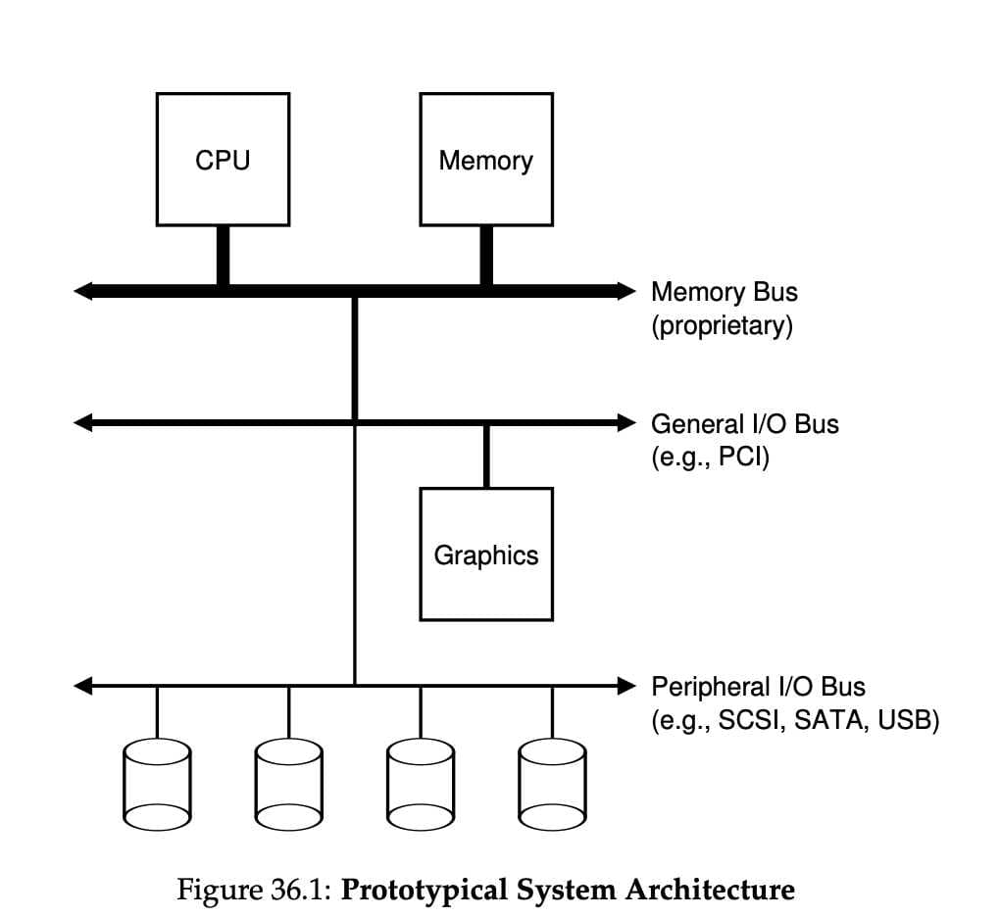
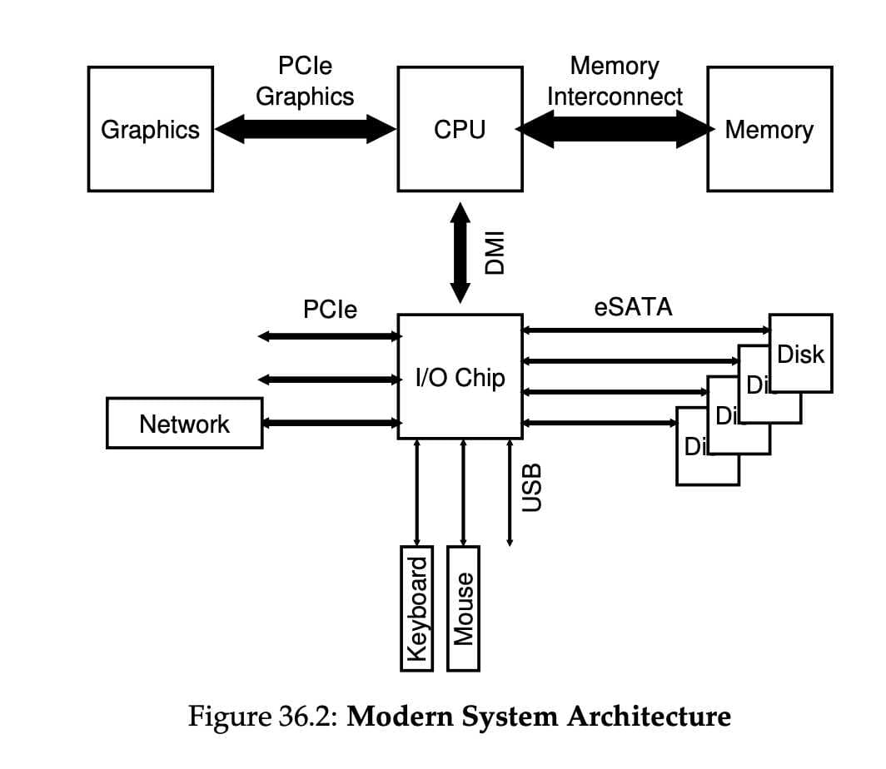
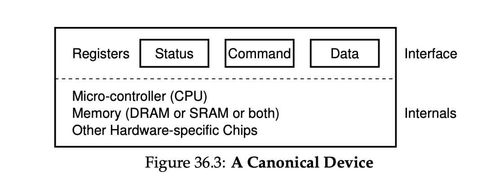
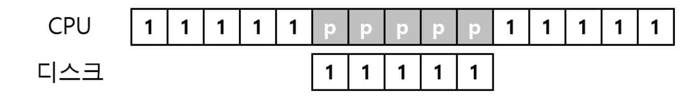
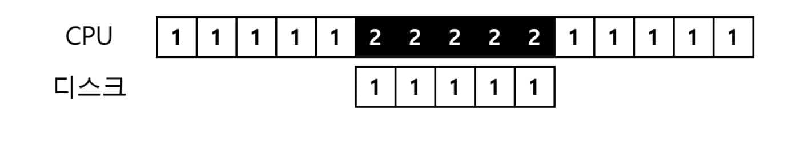
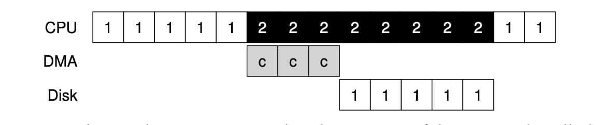
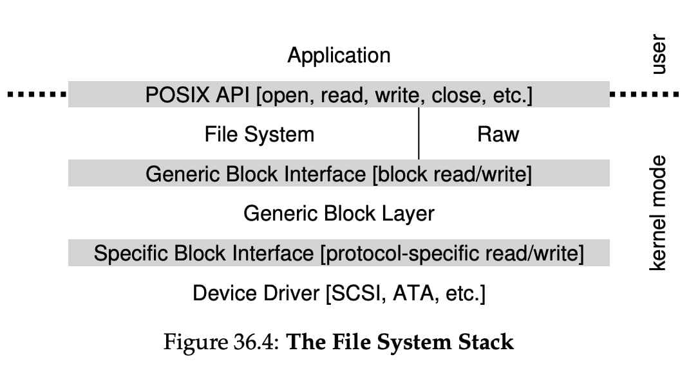
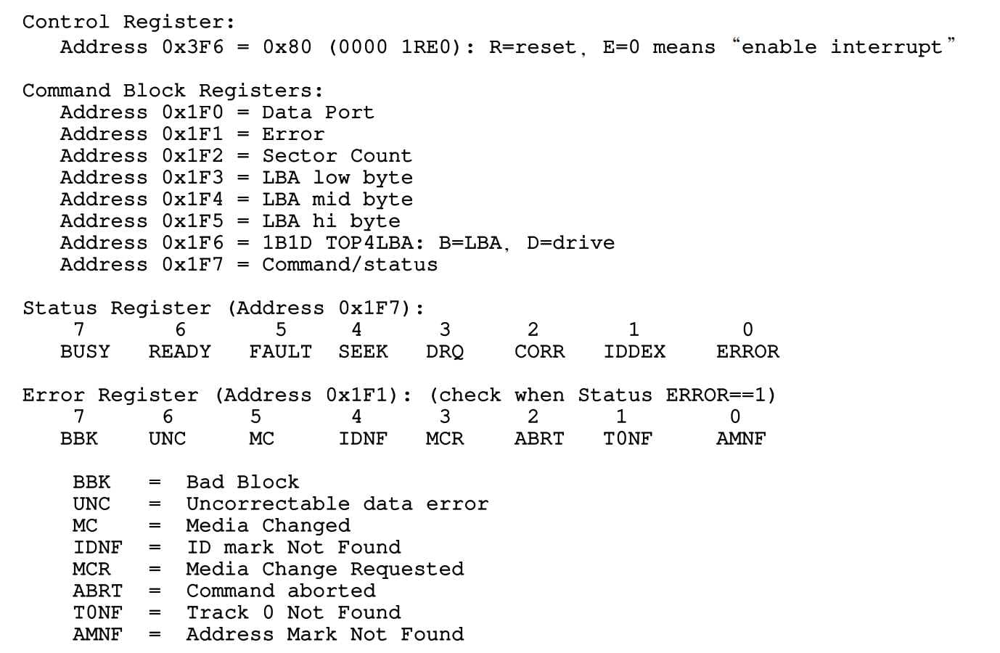

# I/O 장치[^ypilseong]
[^ypilseong]: [양필성](https://github.com/ypilseong)

## 시스템 구조

우선 일반적인 시스템 구조에 대해 알아야 합니다.



CPU와 메인 메모리가 *Memory Bus*로 연결되어 있습니다. 또 몇 가지 장치들이 범용 *I/O Bus*에 연결되어 있습니다. 보통 PCI를 사용하고, 여기에 그래픽 카드나 다른 고성능 I/O 장치들이 연결됩니다. 마지막으로, SCSI, SATA, USB같은 *Peripheral I/O Bus* (주변장치용 버스)가 있습니다. 이 버스들을 통해 디스크나 마우스같이 가장 느린 주변 장치가 연결됩니다.


```{note}
“PCI”는 “Peripheral Component Interconnect”의 약자로, 1990년대 중반부터 2000년대 초반까지 컴퓨터에서 주로 사용되던 IO Bus 표준 중 하나입니다.

PCI에 대한 몇 가지 주요 특징은 다음과 같습니다:

플러그 앤 플레이: 장치를 컴퓨터에 연결하면 운영 체제가 자동으로 장치를 감지하고 설정합니다.

32비트와 64비트 버전: 초기 PCI 버스는 32비트 데이터 경로를 사용했지만, 나중에 64비트 버전도 출시되었습니다.

높은 데이터 전송 속도: PCI 버스는 그 당시 다른 버스 표준에 비해 높은 데이터 전송 속도를 제공했습니다.

범용성: 여러 종류의 장치 (그래픽 카드, 네트워크 카드, 사운드 카드 등)와 호환됩니다.

그러나 PCI는 오래된 기술이기 때문에 현대의 PC나 서버에서는 더 빠른 성능과 확장성을 제공하는 PCI Express (PCIe)와 같은 새로운 표준에 의해 대체되었습니다. PCIe는 PCI의 후속 표준으로, 데이터 전송 속도와 확장성, 그리고 세밀한 전력 관리 기능 등 여러 가지 향상된 기능을 제공합니다.
```
이렇게 계층적인 구조를 만든 이유는 무엇일까요? 버스가 고속화되려면 짧아야 합니다. 때문에 고속의 메모리 버스는 여러 장치들을 수용할 공간이 없고, 그런 고속의 메모리 버스는 굉장히 비쌉니다. 때문에 그래픽 카드와 같은 고성능 장치는 CPU와 가깝게 배치하고, 디스크와 같은 느린 장치들은 주변 장치 I/O 버스에 연결했습니다. 이런 느린 장치들은 여러 개 연결할 수 있습니다.

## 표준 장치



표준 장치에는 두 개의 중요한 구성 요소가 있습니다. 첫 번째는 인터페이스(Interface) 입니다. 소프트웨어가 인터페이스를 제공하듯, 하드웨어도 인터페이스를 제공하여 시스템 소프트웨어가 동작을 제어할 수 있도록 해야 합니다.

두 번째 구성 요소는 내부 구조(Internals) 입니다. 시스템에게 제공하는 장치에 대한 추상화를 정의하는 책임을 가지고 있습니다. 내부 구조 안에는 장치에 따라 다르지만 한두개의 하드웨어 칩을 사용하는 경우도 있고, CPU와 범용 메모리, 그리고 장치에 특화된 칩을 사용하는 경우도 있습니다.

최신 RAID 컨트롤러는 수십만 줄에 달하는 펌웨어 라는 소프트웨어가 하드웨어 내부의 동작을 정의하고 있습니다.

## 표준 방식

위에 그려진 표준 장치 그림을 보면, 세 개의 레지스터가 존재하는 것을 볼 수 있습니다.

- *상태(status)* 레지스터는 장치의 현재 상태를 읽을 수 있습니다.
- *명령어(command)* 레지스터는 장치가 특정 동작을 수행하도록 요청할 때 사용됩니다.
- *데이터(data)* 레지스터는 장치에 데이터를 보내거나 받을 때 사용됩니다.
이번에는 장치가 운영체제를 대신하여 어떤 동작을 할 때, 운영체제와 장치 간에 일어날 수 있는 상호 작용 과정을 살펴보자.
```c
While (STATUS == BUSY)
	; // 장치가 바쁜 상태가 아닐 때까지 대기
데이터를 DATA 레지스터에 쓰기
명령어를 COMMAND 레지스터에 쓰기
	(장치가 명령어 실행)
While (STATUS == BUSY)
	; // 요청이 완료될 때까지 대기
```
표준 방식 (Canonical Protocol)은 네 단계로 이루어져 있습니다.

1. 반복적으로 장치의 상태 레지스터를 읽어서 명령의 수신 가능 여부를 확인합니다. -> 장치에 대해 *폴링(polling)* 합니다고 표현함
2. 운영체제가 데이터 레지스터에 어떤 데이터를 전달합니다. ex) 디스크 블럭. 데이터 전송에 메인 CPU가 관여하는 경우를 *programmed I/O* 라고 합니다.
3. 운영체제가 명령어 레지스터에 명령어를 기록합니다. 명령어가 기록되면 데이터는 이미 준비되었습니다고 가정하고 명령어를 처리합니다.
4. 장치가 처리를 완료했는지를 확인합니다. 여기서도 폴링합니다.
이 표준 방식 (Canonical Protocol)은 계속 polling을 하기 때문에 비효율적입니다. 다른 프로세스에게 CPU를 양도하지 않고 장치가 동작을 완료하는 동안 계속 반복문을 돌며 상태를 확인합니다.

## 인터럽트를 이용한 CPU 오버헤드 개선

디바이스를 계속 polling 하는 대신 운영체제는 입출력 작업을 요청한 프로세스를 block 시키고, CPU를 다른 프로세스에게 양도합니다. 장치가 작업을 끝마치면, 하드웨어 인터럽트를 발생시키고, CPU는 운영체제가 미리 정의해놓은 *인터럽트 서비스 루틴(interrupt service routine(ISR))* 또는 간단하게 *인터럽트 핸들러(interrupt handler)* 를 실행합니다. 이 핸들러는 운영체제 코드의 일부분입니다.

인터럽트 핸들러는 입출력 요청의 완료, I/O 대기중인 프로세스 깨우기 등을 담당합니다.

사용률을 높이기 위한 핵심 방법 중 하나는 인터럽트를 활용하여 CPU 연산과 I/O 연산을 *중첩*시키는 것입니다. 그림으로 알아보자.



이 예제는 CPU가 장치의 작업이 끝날 때 까지 polling 하는 것이고,



이 예제는 장치가 작업을 하는 동안 CPU가 다른 프로세스 2를 실행하는 것입니다. 디스크 요청이 완료되어 인터럽트가 발생하면 운영체제가 다시 프로세스 1을 깨워 실행시킵니다.

인터럽트가 항상 최적의 해법은 아닙니다. 작업이 한 번의 폴링만으로 끝나는 매우 빠른 작업이라면, 인터럽트가 시스템을 느리게 할 것입니다. Context Switching, 인터럽트 처리는 매우 비싼 작업입니다. 빠른 장치에 대해서는 polling, 느린 장치에 대해서는 인터럽트가 좋은 해법이 될 것입니다.

만약 장치의 속도를 잘 모르거나, 빠를 때도 있고 느릴 때도 있는 장치라면 어떻게 하는게 좋을까요? 짧은 시간 동안 폴링을 합니다 처리가 완료되지 않으면 인터럽트를 사용하는 하이브리드 방식을 사용할 수 있습니다.

네트워크 환경에서도, 대량으로 패킷이 도착하는 경우 인터럽트를 사용합니다면, live lock에 빠질 가능성이 높습니다. 사용자가 많이 몰리면 웹 서버가 폴링을 사용해서 좀 더 효율적으로 처리할 수 있습니다.

또 다른 인터럽트 최적화 기법은 *병합(coalescing)* 입니다. CPU에게 인터럽트를 전달하기 전에 잠시 기다린 후, 한 번에 모아서 인터럽트를 전달합니다. 이 방법으로 인터럽트 처리의 오버헤드를 줄일 수 있습니다.

## DMA를 이용한 효율적인 데이터 이동

많은 양의 데이터를 디스크로 전달하기 위해 programmed I/O (PIO)를 사용하면 CPU가 또 다시 단순 작업 처리에 소모됩니다.


이런 식으로 데이터를 메모리에서 디스크로 한 워드씩 copy합니다. 그림에서 c로 표시된 부분입니다.

이 문제에 대한 해법을 직접 메모리 접근 방식(Direct Memory Access, DMA) 이라고 부른다. DMA 엔진은 시스템 내에 있는 특수 장치로서, CPU의 간섭 없이 메모리와 장치 간의 데이터 전송을 담당합니다.



데이터를 장치로 전송합니다고 했을 때, 운영체제는 DMA 엔진에 메모리 상의 데이터 위치와 전송할 데이터의 크기, 그리고 대상 장치를 프로그램합니다. 그러면 데이터가 전송되는 동안 운영체제는 다른 일을 진행할 수 있습니다. DMA 동작이 끝나면 DMA 컨트롤러가 인터럽트를 발생시키고, 운영체제는 전송이 완료되었음을 알 수 있습니다.


## 디바이스와 상호작용하는 방법

첫 번째는 가장 오래된 방법으로, I/O 명령을 명시적으로 사용하는 것입니다. 이 명령어들은 운영체제가 특정 장치 레지스터에 데이터를 전송할 수 있는 방법을 제공합니다.

예를 들어 x86의 경우 `in`과 `out` 명령어를 사용하여 장치들과 통신할 수 있습니다. 이 명령어들은 대부분 특권 명령어들입니다. 때문에 운영체제만이 장치들과 직접 통신할 수 있습니다.

두 번째 방법은 *memory mapped I/O* 입니다. 하드웨어는 장치의 레지스터들이 마치 메모리 상에 존재하는 것 처럼 만듭니다. 특정 레지스터를 접근하기 위해서 운영체제는 해당 주소에 `load`, `store`를 하면 됩니다. 하드웨어는 `load`, `store` 명령어가 주 메모리를 향하는 대신 장치로 연결되게 합니다.

## 운영체제에 연결하기 : 디바이스 드라이버

최종적으로 다룰 문제는 서로 다른 인터페이스를 가지는 수많은 장치들과 운영체제를 연결시키는 일반화된 방법을 찾는 것입니다.

SCSI 디스크, IDE 디스크, USB 등과 같은 기기 위에서 동작하는 파일 시스템을 만들고자 하는데, 각 장치들의 구체적인 입출력 명령어 형식에 종속되게 만들고 싶지 않습니다.

추상화(abstraction)라는 고전적 방법을 사용하여 이 문제를 해결할 수 있습니다.



파일 시스템은 어떤 디스크 종류를 사용하는지 전혀 알지 못합니다. 파일 시스템은 범용 블록 계층에 블럭 `read`, `write`를 요청할 뿐입니다. 범용 블럭 계층은 적절한 디바이스 드라이버로 받은 요청을 전달하며, 디바이스 드라이버는 특정 요청을 장치에 내리기 위해 필요한 일들을 처리합니다. 이 그림을 통해 장치에 대한 구체적인 동작이 어떻게 운영체제의 대부분에게 숨겨지는지 알 수 있습니다.

이런 캡슐화는 단점도 있습니다. 커널이 범용적인 인터페이스만을 제공하는 경우, 특수 기능을 많이 가진 장치는 사용하기 힘들 것입니다.

어떤 장치를 시스템에 연결하든 디바이스 드라이버가 필요하기 때문에, *시간이 지나면서 디바이스 드라이버 코드가 커널 코드의 대부분을 차지하게 되었습니다*. 드라이버들이 대부분 전업 커널 개발자가 아닌 개발자들에 의해 만들어지기 때문에 상당한 버그를 포함하고 있고, 커널 크래시의 주범이 되고 있습니다.
## 사례 연구 : 간단한 IDE 디스크 드라이버

IDE 디스크는 시스템에 Control, Command block, Status, Error 4개의 레지스터로 이루어진 단순한 인터페이스를 제공합니다.

이 레지스터들은 x86의 `in`, `out` I/O 명령어를 사용하여 특정 I/O의 주소들을 읽거나 씀으로써 접근 가능합니다. 그림에 보이는 `0x3F6`과 같은 주소를 읽는 것입니다.



- 장치가 준비될 때까지 대기 -> 드라이브가 사용 중이지 않고 READY 상태가 될 때까지 Status 레지스터 `0x1F7`을 읽습니다.
- Command 레지스터에 인자 값 쓰기 -> 섹터의 수와 접근해야 할 섹터들의 논리 블럭 주소 (LBA), 그리고 드라이브 번호를 Command 레지스터 `0x1F2` ~ - `0x1F6`에 기록합니다.
- I/O 시작 -> Command 레지스터에 읽기, 쓰기를 전달합니다. `READ`-`WRITE` 명령어를 Command 레지스터에 기록합니다. `0x1F7`
- 데이터 전송 (쓰기) -> 드라이브의 상태가 READY이고 DRQ(Drive Request for Data)일 때까지 기다립니다. 데이터 포트에 데이터를 기록합니다.
- 인터럽트 처리 -> 간단하게는 각 섹터가 전송되었을 때마다 인터럽트를 처리하게 하고, 복잡하게는 일괄처리가 가능하도록 만들어서 모든 전송이 완료되었을 때 최종적으로 한 번만 인터럽트를 발생시키도록 합니다.
- 에러 처리 -> 각 동작 이후에 Status 레지스터를 읽습니다. 만약 ERROR 비트가 설정되어 있다면 Error 레지스터를 읽어서 상세 정보를 확인합니다.

```c
// 시작 요청 루틴은 이 함수를 사용하여 요청을 명령하기 전에 드라이브가 준비되었는지 확인합니다.
static int ide_wait_ready() {
	while (((int r = inb(0x1f7)) & IDE_BSY) || ! ( r & IDE_DRDY))
		; // 드라이버가 바쁘지 않을 때까지 반복문 수행
}

// 요청을 디스크로 내려 보낸다.
// x86의 in, out 명령어가 장치 레지스터를 읽거나 쓰는데 사용된다
static void ide_start_request(struct buf *b) {
	ide_wait_ready();
	outb(0x3f6, 0); // 인터럽트 발생
	outb(0x1f2, 1); // 섹터 몇개?
	outb(0x1f3, b−>sector & 0xff); // LBA 기록
	outb(0x1f4, (b−>sector >> 8) & 0xff); // LBA 기록
	outb(0x1f5, (b−>sector >> 16) & 0xff); // LBA 기록
	outb(0x1f6, 0xe0 | ((b−>dev&1)<<4) | ((b−>sector>>24)&0x0f));
	
	if(b−>flags & B_DIRTY) {
			outb(0x1f7, IDE_CMD_WRITE); // WRITE
			outsl(0x1f0, b−>data, 512/4); // 데이터 전송
	} else {
			outb(0x1f7, IDE_CMD_READ); // READ
	}
}

// 대기 중인 다른 요청들이 있다면 요청을 큐에 삽입하거나 디스크에 직접 명령합니다.
// 어느 경우건 요청이 처리 완료되기를 기다리며, 호출한 프로세스는 재운다.
void ide_rw(struct buf *b) {
	acquire(&ide_lock);
	for (struct buf **pp = &ide_queue; *pp; pp=&(*pp)−>qnext)
		; // 큐를 순회
	*pp = b; // 요청을 맨 뒤에 추가
	if (ide_queue == b) // 큐가 비었습니다면
		ide_start_request(b); // 디스크에 request 보냄
	while ((b−>flags & (B_VALID|B_DIRTY)) != B_VALID)
		sleep(b, &ide_lock); // 완료 대기
	release(&ide_lock);
}

// 인터럽트가 발생했을 때 호출된다
// 장치에서 데이터를 읽고, I/O가 종료되기를 기다리는 프로세스를 깨운다
// 그리고 요청이 더 큐에 있다면 ide_start_request를 이용하여 다음 요청 처리를 시작합니다.
void ide_intr() {
	struct buf *b;
	acquire(&ide_lock);
	if (! (b−>flags & B_DIRTY) && ide_wait_ready() >= 0)
		insl(0x1f0, b−>data, 512/4); // READ인 경우 데이터 가져오기
	b−>flags |= B_VALID;
	b−>flags &= .B_DIRTY;
	wakeup(b); // 대기 중인 프로세스 깨우기
	if ((ide_queue = b−>qnext) != 0) // 다음 요청이 존재하는 경우 요청 시작
		ide_start_request(ide_queue);
	release(&ide_lock);
}
```
이렇게 4개의 기본 함수를 통하여 동작합니다.

## 요약

두 가지 기술인 인터럽트와 DMA는 장치의 효율을 높이기 위해 도입되었으며 명시적 I/O 명령어와 메모리 맵 I/O를 사용하여 장치의 레지스터에 접근할 수 있다는 것을 알게 되었습니다.

마지막으로 디바이스 드라이버의 개념을 소개하면서 하위 계층의 세부적인 내용을 운영체제가 캡슐화 할 수 있으며, 이를 활용하여 운영체제의 나머지를 장치 중립적으로 구현할 수 있다는 것을 알게 되었습니다.