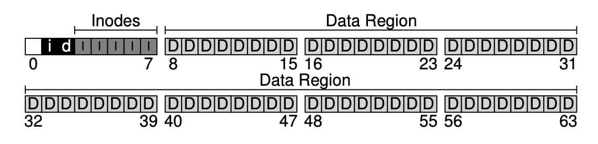
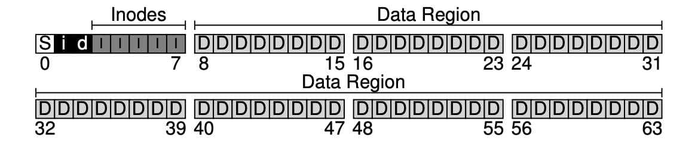
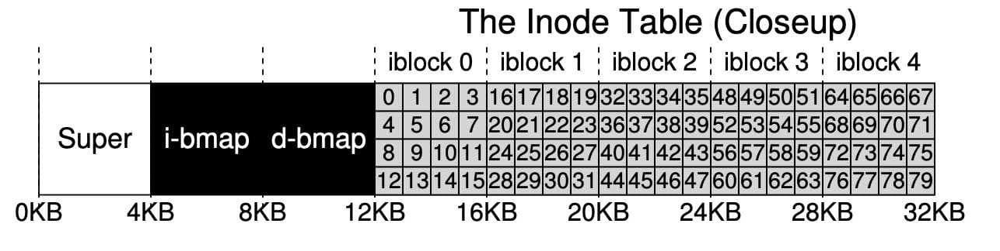
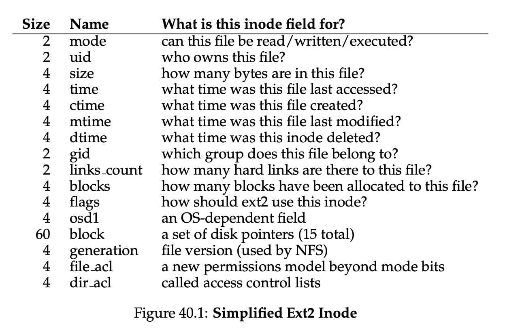
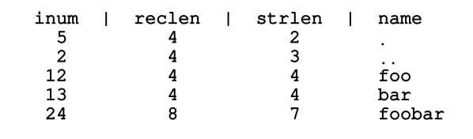
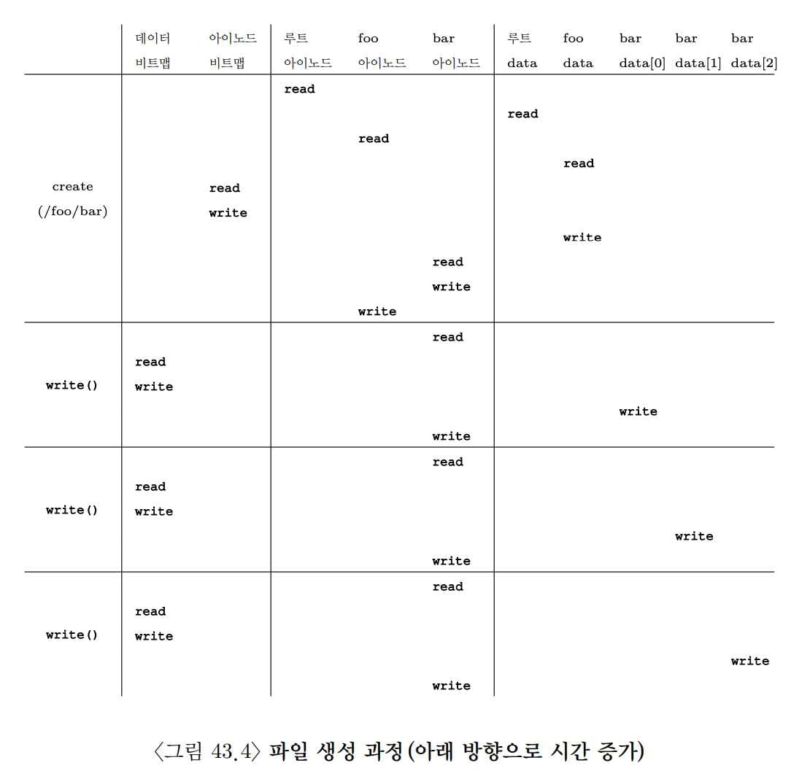

# 파일 시스템 구현[^ypilseong]

[^ypilseong]: [양필성](https://github.com/ypilseong)

## 생각하는 방법

파일 시스템에 대해 학습할 때 이런 방식으로 접근하면 도움이 됩니다.

첫 번째는 파일 시스템의 자료 구조입니다. 파일 시스템이 자신의 데이터와 메타데이터를 관리하기 위해 어떤 자료 구조를 사용할까요? vsfs같은 파일 시스템은 블럭과 다른 객체들을 배열과 같은 간단한 자료 구조로 표현했지만 XFS와 같은 파일 시스템들은 좀 더 복잡한 트리 기반의 자료 구조를 사용합니다.

두 번째는 접근 방법입니다. 프로세스가 호출하는 `open()`, `read()`, `write()` 등의 명령들은 파일 시스템의 자료 구조와 어떤 관련이 있을까요? 특정 시스템 콜을 실행할 때 어떤 자료 구조들이 읽힐까요? 어떤 것들이 쓰일까요?

자료 구조와 접근 방법에 대해 이해하면 파일 시스템이 어떻게 작동하는지에 대한 개념을 잘 정립할 수 있습니다.

## 전체 구성

가장 먼저 해야 할 것은 디스크를 _블럭(block)_ 단위로 나누는 것입니다. 단일 블럭 크기만 사용하고, 4KB로 정합시다. N개의 4KB 블럭 크기를 가지는 파티션에서, 블럭은 0부터 N-1까지 주소를 가지고 있습니다. 블럭이 64개 있는 작은 디스크를 생각해봅시다.

이 블럭에 무엇이 들어가야 할까요? 가장 먼저 떠오르는 것은 사용자의 데이터입니다. 대부분의 공간이 사용자의 데이터로 채워져 있습니다. 이를 _데이터 영역 (data region)_ 이라고 합시다.


파일 시스템은 각 파일에 대한 정보를 관리합니다. 그 정보가 *메타데이터*의 핵심입니다. 파일을 구성하는 데이터 블럭들, 그 파일의 크기, 소유자, 접근 권한, 접근과 변경 시간 등과 같은 정보가 메타데이터입니다. 파일 시스템은 이러한 정보를 _아이노드(inode)_ 라고 부르는 자료 구조에 저장합니다.

이 아이노드들은 아이노드 테이블에 저장됩니다. 아이노드당 256bytes를 가정하면 4KB 블럭 하나에 16개의 아이노드를 저장할 수 있습니다. 우리 디스크 파티션에는 80개의 아이노드를 저장할 수 있습니다.


아직 더 필요한 정보가 남아 있습니다. 아이노드나 데이터 블럭의 사용 여부에 관한 정보입니다. _할당 구조(allocation structure)_ 가 필요합니다.

블럭이 사용 중인지 아닌지를 표현하는 데에는 다양한 방법이 있습니다. free list를 사용해서, 사용 중이 아닌 블럭들을 연결 리스트로 관리하는 방법도 있습니다. 아이노드는 첫 번째 프리 블럭의 위치만 기억하면 됩니다. 우리는 단순한 비트맵을 사용합니다. 데이터 비트맵으로 데이터 영역이 사용 중인지, 아이노드 비트맵으로 아이노드 테이블에 있는 아이노드들이 사용 중인지를 나타냅니다. 비트맵은 비트들의 배열입니다. 각 비트는 해당 블럭이나 객체가 사용 중인지(in-use: 1) 사용 중이 아닌지(free: 0)나타냅니다.



남은 한 블럭은 슈퍼블럭(superblock) 을 위한 공간입니다 (S로 나타냄). 슈퍼블럭은 이 파일 시스템 전체에 대한 정보를 담고 있습니다. 예를 들어, 파일 시스템에 몇 개의 아이노드와 데이터 블럭이 있는지, 아이노드 테이블은 어디서 시작하는지와 같은 정보를 가지고 있습니다. 파일 시스템을 식별할 수 있는 매직 넘버도 가지고 있습니다. 파일 시스템이 깨진다는 것은, 슈퍼블럭이 저장된 디스크 블럭이 훼손되는 것입니다. 일반적으로 파일 시스템은 슈퍼블럭을 몇 개 복사해둡니다.



운영체제가 우선 슈퍼블럭을 읽어들여서 파일 시스템의 여러 요소들을 초기화하고, 그 후 각 파티션을 파일 시스템 트리에 붙이는 작업을 통해 파일 시스템을 마운트합니다.

## 파일 구성 : 아이노드

파일 시스템의 자료 구조 중 가장 중요한 것은 아이노드입니다. index node의 줄임말입니다.

각 아이노드는 숫자 inumber로 표현됩니다. vsfs에서는 아이넘버를 통해 해당 아이노드가 디스크 어디에 있는지를 직접적으로 계산할 수 있습니다. 위에서 사용한 아이노드 테이블로 계산해봅시다. 아이노드 영역은 크기가 20KB이고 80개의 아이노드(각 256bytes)로 이루어져 있습니다. 아이노드 영역은 12KB 위치부터 시작합니다.



32번 아이노드를 읽기 위해 파일 시스템은 아이노드 영역에서의 오프셋을 계산합니다. 그후 아이노드 테이블의 시작 위치를 더하면 원하는 아이노드 블럭의 정확한 바이트 주소를 계산할 수 있습니다.

디스크는 바이트 단위로는 접근이 불가능하며, 대신에 512바이트 크기를 갖는 섹터로 이루어졌습니다. 32번 아이노드가 존재하는 블럭을 가져오기 위해 파일 시스템은 섹터 주소를 계산하여 읽기 요청을 한 후 해당 아이노드 블럭을 가져옵니다.

```c
blk = (inumber * sizeof(inode_t)) / blockSize;
sector = ((blk * blockSize) + inodeStartAddr) / sectorSize;
```

아이노드에는 파일에 대한 정보가 다 들어있습니다. 파일의 종류, 크기, 할당된 블럭 수, 보호 정보, 시간 정보와 더불어 데이터 블럭이 디스크 어디에 존재하는지(포인터의 일종) 등과 같은 정보들이 담겨 있습니다.



아이노드 설계시 가장 중요한 부분 중 하나는 데이터 블럭의 위치를 표현하는 방법입니다. 간단한 방법은 아이노드 내에 여러 개의 직접 포인터를 두는 것입니다. 각 포인터는 파일의 디스크 블럭 하나를 가리킵니다. 이 방법에는 파일 크기의 제한이 있습니다. 파일 크기가 포인터의 개수 $\times$ 블럭 크기로 제한됩니다.

### 멀티 레벨 인덱스

파일 크기 제한으로 인해, 파일 시스템 개발자들은 아이노드 내에 다른 자료 구조를 추가했습니다. 일반적으로는 간접 포인터를 사용합니다. 간접 포인터는 데이터 블럭을 가리키지 않고, _데이터 블럭을 가리키는 포인터들이 저장된 블럭을 가리킵니다._

블럭이 4KB이고 디스크 주소가 4바이트라고 하면 1024개의 포인터들을 추가할 수 있게 됩니다. 최대 파일 크기는
$(12 + 1024) \times 4KB$ 가 됩니다. 여기서 12는 정해진 수의 직접 포인터입니다.

저 사이즈가 모자라면 이중, 삼중 간접 포인터를 사용하면 원하는 만큼 큰 파일을 표현할 수 있습니다.

이제까지 설명한 것을 종합하면, 디스크 블럭들은 트리 형태로 구성되어 하나의 파일을 이룹니다. 이러한 구성 방식을 멀티 레벨 인덱스 기법이라 합니다.

이 때 트리의 형태는 편향된 트리입니다. 파일의 시작 부분을 이루는 블럭들은 한 번의 포인터로 접근 가능하지만, 파일의 끝부분에 있는 블럭들은 포인터를 세 번 따라가야 실제 블럭을 읽을 수 있습니다. 이렇게 설계된 이유는 대부분의 파일의 크기는 작다 라는 사실에 기인한 것입니다.

## 디렉터리 구조

vsfs의 디렉터리는 간단합니다. 디렉터리는 (항목의 이름, 아이노드 번호) 쌍의 배열로 구성되어 있습니다. 디렉터리의 데이터 블럭에는 문자열과 숫자가 쌍으로 존재하며 문자열 길이에 대한 정보도 있습니다.

dir이라는 디렉터리 안에 foo, bar, foobar 라는 3개의 파일이 있고 각각의 아이노드 번호가 12, 13, 24라고 합시다. dir의 데이터 블럭은 아래와 같은 내용을 가지고 있을 것입니다.



아이노드 번호, 레코드 길이(이름에 사용된 총 바이트 + 남은 공간), 이름 길이, 항목의 이름으로 이루어져 있습니다.

.은 현재 디렉터리, ..은 부모 디렉터리를 가리킵니다.

`unlink()` 등의 호출로 파일이 삭제되면 디렉터리 중간에 빈 공간이 발생합니다. 영역이 비었다는 것을 표시할 방법이 필요합니다(ex: 아이노드 번호 0은 비었다는 뜻). 항목의 길이를 명시하는 이유 중 하나가 중간에 빈 공간이 생기기 때문입니다. 새로운 디렉터리 항목을 생성할 때 빈 공간에 위치시킬 수 있습니다.

디렉터리는 대체 어디에 저장되는 걸까요? 대부분 파일 시스템에서 디렉터리는 특수한 종류의 파일로 간주합니다. 디렉터리는 자신의 아이노드를 가지며, 아 아이노드는 아이노드 테이블에 존재합니다. 디렉터리는 자신의 데이터 블럭을 가지고 있으며 이들 블럭의 위치는 일반 파일과 마찬가지로 아이노드에 명시되어 있습니다.

## 빈 공간의 관리

vsfs에서는 두 개의 비트맵을 사용해서 빈 공간을 관리합니다.

파일 생성 시 아이노드를 할당해야 합니다. 아이노드 비트맵을 탐색하여 비어 있는 아이노드를 찾아 파일에 할당합니다. 파일 시스템은 해당 아이노드를 사용 중 (1) 로 표기하고 디스크 비트맵도 적절히 갱신합니다. 데이터 블럭을 할당할 때도 이와 비슷합니다.

데이터 블럭을 할당할 때도 고려할 사항이 있습니다. 데이터 블럭 할당 시 가능하다면 여러 개의 블럭들이 연속적으로 비어 있는 공간을 할당합니다. 이를 통해 해당 파일의 입출력 성능을 개선할 수 있습니다. 이를 _선할당(pre-allocation)_ 정책이라 합니다.

## 실행 흐름 : 읽기와 쓰기

파일 시스템은 마운트되었고 슈퍼블럭은 메모리 상에 위치한다고 가정합시다. 다른 모든 것 (아이노드, 디렉터리)들은 디스크에 존재합니다. 메모리에는 아직 탑재되지 않았습니다

디스크에서 파일 읽기
`open("/foo/bar", O_RDONLY)` 시스템 콜을 하면 파일 시스템은 먼저 파일 bar에 대한 아이노드를 찾아서 파일에 대한 기본적인 정보를 획득해야 합니다. 전체 경로명을 가지고 있기 때문에 파일 시스템은 경로를 따라 원하는 아이노드를 찾습니다.

경로명을 따라가는 것은 항상 파일 시스템의 루트에서 시작합니다. `/`로 표기됩니다.

루트 디렉터리의 아이노드를 찾아야 합니다. 루트 디렉터리의 아이노드 번호는 보통 2로 정의되어 있습니다. 파일 시스템은 아이넘버 2가 포함된 블럭을 읽습니다.

파일 시스템은 읽어들인 아이노드에서 데이터 블럭의 포인터를 추출합니다. 이 포인터들을 사용하여 디렉터리 정보를 읽고, foo 라는 항목을 찾습니다. 디렉터리에 많은 항목이 들어있으면 여러 개의 데이터 블럭이 필요할 수 있습니다. 이들을 모두 읽어서 foo를 찾아야 합니다.

foo 파일의 디렉터리 항목을 찾아서, foo의 아이노드 번호를 파악합니다. 44번이라고 합시다. 이를 통해 bar에 대한 아이노드 번호도 찾아낼 수 있습니다.

`open()`을 통해 bar에 대한 아이노드를 메모리에 적재합니다. 파일 시스템에서는 최종적으로 해당 파일에 대한 접근 권한을 확인하고, 이 프로세스의 open file table에서 파일 디스크립터를 할당받아 사용자에게 리턴합니다.

`open()` 이후에는 `read()` 시스템 콜을 통해 파일을 읽습니다. 이 때 첫 번째 읽기 작업이므로 첫 번째 블럭을 읽게 될 것이고, 마지막으로 읽은 시간을 아이노드에 기록합니다. `read()`는 open file table에서 해당 파일 디스크립터에 대한 오프셋을 갱신합니다. 다음 읽기 작업을 할 때 오프셋 다음부터 읽게 할 것입니다.

어느 시점이 되면 파일을 닫아야 하는데 이건 그냥 할당된 파일 디스크립터를 해제하면 됩니다. 디스크 I/O는 발생하지 않습니다.

![image][./figs/image-12.jpeg]

이 그림에서는 파일을 여는 과정 중에 파일의 아이노드를 찾기 위해서 여러 번의 읽기가 일어나는 것을 보여주고 있습니다. 그 뒤에 각 블럭을 읽기 위해서 파일 시스템은 먼저 아이노드를 읽고 블럭을 읽습니다. 그리고 아이노드의 마지막 접근 시간을 갱신합니다. 무슨 일이 발생하는지 다시 한 번 차분히 이해해 봅시다.

I/O 발생 횟수는 경로의 길이에 비례합니다. 디렉터리가 많아지면 더 오래 걸립니다.

### 디스크에 쓰기

디스크에 쓰기도 비슷한 과정입니다.

먼저 파일을 열고, `write()`를 호출하여 새로운 내용으로 파일을 갱신합니다. 최종적으로는 파일을 닫습니다.

읽기와는 다르게 파일 쓰기는 블럭 할당을 필요로 할 수 있습니다. 새로운 파일에 쓸 때는 `write()`는 데이터를 디스크에 기록해야 할 뿐만 아니라, 파일에 어느 블럭을 할당해야 할 지를 결정해야 하고, 그에 따라 데이터 비트맵, 아이노드 등을 갱신해야 합니다.

그러므로 파일에 대한 쓰기 요청은 _논리적으로 5번의 I/O를 생성합니다._

1. 데이터 비트맵 읽기
2. 데이터 비트맵 쓰기
3. 아이노드 읽기
4. 아이노드 쓰기
5. 실제 블럭에 기록

파일 생성과 같은 단순 작업에도 많은 양의 쓰기가 발생합니다.

1. 아이노드 비트맵 읽기
2. 아이노드 비트맵 쓰기
3. 아이노드 쓰기
4. 디렉터리의 데이터 블럭에 쓰기
5. 디렉터리 아이노드 읽기
6. 디렉터리 아이노드 쓰기

다음은 `/foo/bar`를 생성하고 그 안에 세개의 블럭을 쓰는 과정입니다.



파일 생성이 얼마나 대형 작업인지를 알 수 있습니다. 경로명을 따라가서 파일을 생성하는 데 10번의 I/O가 발생했습니다. 그리고 `write()` 한 번마다 5번의 I/O가 발생했습니다. 새로운 파일 블럭을 필요로 하는데 이를 *allocating write*라 합니다.

## 캐싱과 버퍼링

I/O가 너무 많이 발생합니다. 성능 개선을 위해 대부분 파일 시스템은 자주 쓰는 블럭들을 메모리에 캐싱합니다. 가상 메모리에서 했던 것 처럼, LRU와 기타 캐시 교체 정책들을 고려해야 합니다.

캐싱과 함께하는 파일 열기

1. 디렉터리 아이노드와 데이터로 인해 많은 I/O 발생
2. 같은 파일을 열면 캐시에서 히트가 되기 때문에 추가 I/O 발생하지 않음

캐싱과 함께하는 파일 쓰기

- 읽기 I/O는 캐시가 충분히 크면 대부분 제거 가능
- 메모리에 쓴 경우, 영속성을 위해 이걸 디스크로 내려 보내야 합니다.
- 캐시는 쓰기 시점을 연기할 수 있다 -> 쓰기 버퍼링
  - 다수 작업 배치 처리
  - 스케줄링
  - 만들고 바로 삭제하는 경우 아예 없던 일로 할 수 있음

DB 시스템 등은 버퍼링으로 발생하는 문제점을 용납하지 않습니다. 방금 입금했는데 컴퓨터가 꺼져서 디스크에 기록이 되지 않았다면? 이런 일을 피하기 위해 `fsync()`를 사용합니다. 이를 호출하면 갱신된 내용이 디스크에 강제적으로 기록됩니다. 캐시를 아예 사용하지 않도록 하는 경우도 있습니다.

## 요약

파일 시스템 개발에 필요한 기본 기법들을 살펴보았습니다 각 파일에 어떤 정보 (메타데이터)가 필요한지 살펴보면서 대부분은 아이노드라고 부르는 자료 구조에 저장한다는 것을 보았습니다. 디렉터리는 특수 파일로서 파일 이름과 아이노드 번호 간의 연결정보를 저장합니다. 다른 자료 구조들이 더 있습니다. 예를 들면 파일 시스템은 아이노드나 데이터 블럭의 할당과 해제 여부를 나타내는 비트맵과 같은 정보를 갖고 있습니다.
