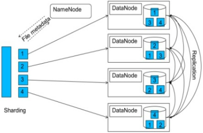

# 분산 시스템

## 통신의 기본

분산 시스템은 여러 독립적인 컴퓨터가 네트워크를 통해 상호작용하여 하나의 일관된 시스템으로 동작하는 환경을 말합니다. 통신은 이러한 시스템에서 필수적인 역할을 합니다. 통신을 통해 분산된 구성 요소들은 데이터를 교환하고, 작업을 조율하며, 리소스를 공유할 수 있습니다.

네트워크 통신의 기본 요소는 다음과 같습니다.
1. **네트워크 프로토콜**: 데이터 전송 방식을 정의하는 규칙 집합입니다. TCP/IP는 가장 널리 사용되는 네트워크 프로토콜로, 패킷 스위칭, IP 주소 지정, 전송 제어 등을 포함합니다.

2. **네트워크 토폴로지**: 네트워크 구성 요소들의 물리적 또는 논리적 배열을 의미합니다. 스타, 버스, 링, 메시 등의 형태가 있습니다.

3. **데이터 전송 방식**: 패킷 교환, 회선 교환, 메시지 교환 등의 방법이 있습니다. 패킷 교환 방식은 데이터가 작은 패킷으로 나뉘어 독립적으로 전송됩니다.

## 신뢰할 수 없는 통신 계층

신뢰할 수 없는 통신 계층에서는 데이터 전송 중 다음과 같은 문제들이 발생할 수 있습니다.
- **데이터 손실**: 데이터그램이 전송 중 손실될 수 있습니다.
- **데이터 중복**: 동일한 데이터그램이 여러 번 수신될 수 있습니다.
- **순서 바뀜**: 데이터그램이 전송된 순서와 다르게 도착할 수 있습니다.

이러한 문제들을 허용하는 프로토콜 중 하나는 **UDP (User Datagram Protocol)**입니다. UDP는 비연결형 프로토콜로, 연결 설정 없이 데이터를 전송합니다. 속도가 빠르고 오버헤드가 적지만, 데이터의 신뢰성을 보장하지 않습니다. 따라서, 실시간 스트리밍, 온라인 게임 등 데이터 손실을 감수할 수 있는 애플리케이션에 적합합니다.

## 신뢰할 수 있는 통신 계층

신뢰할 수 있는 통신 계층은 데이터 전송의 신뢰성을 보장합니다. 주요 특징은 다음과 같습니다.
- **데이터 무결성**: 전송된 데이터가 손실되거나 손상되지 않도록 보장합니다.
- **데이터 순서 보장**: 데이터가 전송된 순서대로 수신됩니다.
- **흐름 제어**: 송신자가 수신자의 처리 능력을 초과하지 않도록 조절합니다.
- **혼잡 제어**: 네트워크 혼잡을 방지하고 조절합니다.

이러한 기능을 제공하는 대표적인 프로토콜은 **TCP (Transmission Control Protocol)**입니다. TCP는 연결형 프로토콜로, 데이터 전송 전에 송신자와 수신자 간에 연결을 설정합니다. 데이터 전송 중에는 확인 응답(ACK)을 사용하여 데이터가 제대로 도착했는지 확인하며, 오류가 발생하면 재전송합니다.

## 통신 추상화

통신 추상화는 네트워크 통신의 복잡성을 단순화하여 개발자가 쉽게 통신 기능을 사용할 수 있도록 합니다. 주요 통신 추상화 기법은 다음과 같습니다.
- **소켓 프로그래밍**: 네트워크 통신을 위한 API를 제공하여, 개발자가 네트워크 프로토콜의 세부 사항을 신경 쓰지 않고도 통신을 구현할 수 있게 합니다. 소켓은 네트워크 연결의 끝점을 나타내며, 이를 통해 데이터를 송수신할 수 있습니다.
- **메시지 큐**: 비동기 통신을 지원하는 기법으로, 메시지를 큐에 저장하고 필요한 때에 처리할 수 있게 합니다. 이를 통해 구성 요소 간의 느슨한 결합과 비동기 처리를 구현할 수 있습니다.
- **이벤트 버스**: 이벤트 기반 통신을 지원하여, 시스템 내에서 발생하는 이벤트를 중앙 버스를 통해 전달합니다. 이를 통해 구성 요소 간의 이벤트 전달과 반응을 용이하게 할 수 있습니다.

통신 추상화는 분산 파일 시스템에서도 중요한 역할을 합니다. 다음 다이어그램은 분산 파일 시스템에서의 데이터 분산(sharding) 및 복제(replication) 메커니즘을 시각적으로 설명합니다.

- **데이터 분산 (Sharding)**
데이터 분산은 큰 파일을 작은 청크로 나누어 여러 노드에 저장하는 과정입니다. 각 청크는 고유의 식별자를 가지며, 메타데이터는 중앙의 NameNode에 의해 관리됩니다.

- **데이터 복제 (Replication)**
데이터 복제는 각 데이터 청크의 복사본을 여러 노드에 저장하여 데이터의 가용성과 신뢰성을 보장하는 과정입니다. 만약 하나의 노드가 실패하더라도, 다른 노드에 저장된 복사본을 통해 데이터 접근이 가능합니다.

## Remote Procedure Call (RPC)

Remote Procedure Call (RPC)은 네트워크를 통해 원격 시스템의 함수를 호출하는 기술입니다. RPC는 분산 시스템에서 로컬 함수 호출처럼 편리하게 원격 함수 호출을 가능하게 하여, 네트워크 통신의 복잡성을 숨깁니다. RPC의 주요 특징은 다음과 같습니다.
- **투명성**: 개발자가 로컬 함수 호출과 동일한 방식으로 원격 함수를 호출할 수 있습니다.
- **데이터 직렬화**: 함수 호출 시 전달되는 인자와 반환 값은 네트워크를 통해 전송될 수 있도록 직렬화됩니다.
- **에러 처리**: 네트워크 오류나 원격 함수 실행 오류를 처리할 수 있는 메커니즘을 제공합니다.

이 다이어그램은 클라이언트와 서버 간의 요청과 응답의 흐름을 명확히 보여주며, RPC의 기본적인 작동 방식을 이해하는 데 도움을 줍니다. 클라이언트는 원격 함수를 호출하고 응답을 기다리며, 서버는 요청을 받아 해당 함수를 실행하고 결과를 반환합니다.

RPC의 구현 예시로는 gRPC와 Apache Thrift가 있습니다. gRPC는 Google이 개발한 고성능 RPC 프레임워크로, HTTP/2와 프로토콜 버퍼를 사용하여 효율적인 통신을 제공합니다. Apache Thrift는 다양한 프로그래밍 언어와의 상호 운용성을 지원하며, 컴팩트한 바이너리 프로토콜을 사용합니다.

## 요약

분산 시스템에서 통신은 시스템의 핵심적인 요소입니다. 신뢰할 수 없는 통신 계층에서는 데이터 손실, 중복, 순서 바뀜 등이 발생할 수 있으며, UDP와 같은 비연결형 프로토콜이 사용됩니다. 반면, 신뢰할 수 있는 통신 계층은 데이터의 무결성과 순서를 보장하며, TCP와 같은 연결형 프로토콜을 사용합니다. 통신 추상화는 네트워크 통신의 복잡성을 단순화하여 개발자가 쉽게 통신 기능을 사용할 수 있게 합니다. 마지막으로, RPC는 네트워크를 통해 원격 시스템의 함수를 호출할 수 있게 하여, 분산 시스템의 개발을 용이하게 합니다.